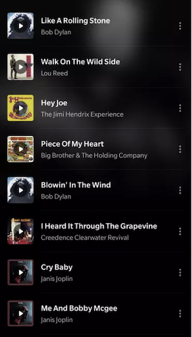
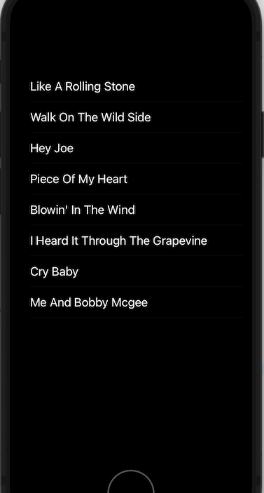

`Desarrollo Mobile` > `Swift Intermedio`


### **POSTWORK**

## Sesión 01

## **Tableviews y Funciones en Swift**

### INTRODUCCIÓN

Durante la sesión se aprendió como los objetos TableView se pueden agregar de varias maneras a nuestro proyecto iOS. Es importante identificar las ventajas y desventajas que cada una de ellas nos ofrece para poder elegir la más apropiada dependiendo del proyecto que estemos realizando.


### OBJETIVO

●   Reconocer los conceptos de delegate y datasource.

●   Diseñar la personalización de las celdas de un Tableview.

#### REQUISITOS

1. Xcode 

#### DESARROLLO

Todos los usos de un Tableview y las formas de implementarlo representan un paso más en el desarrollo de una App iOS. Recuerda que todos los conocimientos del Prework, Work y Postwork pueden reflejarse como avances de tu proyecto.

**Asegúrate de comprender:** 

1. Cuándo y cómo es  necesario utilizar un objeto TableView.
2. Cómo puedes integrar un objeto TableView con otros controles en una vista.
3. Cuáles son las principales funciones que se deben implementar para presentar     apropiadamente un objeto TableView.

## **Indicaciones generales:**

El propósito de este Postwork es retomar el proyecto Xcode del módulo Fundamentals y agregar algunos elementos que se describen a continuación:

●   Agrega una nueva vista en el StoryBoard, que sea de tipo TableViewController.

●   Agrega el archivo Swift correspondiente y conéctalo en el StoryBoard. Nómbralo **TracksTableViewController.swift**

●   Observa la siguiente imagen y determina lo que se solicita.

****

#### Determina

○   Cuántas secciones tiene ese Tableview

○   Cuántas filas y secciones hay en la tabla (considerando solo lo que se ve en la imagen)

○   Qué controles se usan en cada Celda

 

- En nuestro archivo Modelos.swift agrega una estructura Track :

````
  struct Track {
  	let title: String
      let artist: String
      let album: String
  } 
````

  ​


  Además añade una constante tipo arreglo de Track de la siguiente forma, donde agregarás todos los objetos que correspondan a las canciones mostradas en la imagen:

````
let misTracks = [ 	Track(title:"Like A Rolling Stone", artist:"Bob Dylan", album:""),
					Track(title:"Walk On The Wild Side", artist:"Lou Reed", album:""),
                    Track ( .....  )
                    …
                    …
                    …,  etc,                                        
                    ]
````
  

●   En el archivo Swift implementa los métodos necesarios para que la tabla despliegue el número de secciones y celdas que se determinaron necesarias para reflejar esa pantalla.

●   En el archivo Swift implementa el código necesario para que cada celda muestre el título de la canción o álbum, según se muestra en la imagen. Hazlo considerando lo siguiente:

​	a. Debes configurar el **reuseIdentifier** en el storyboard para que no se produzca un error fatal (recuerda lo estudiado durante la sesión).

​	b. Cada objeto del arreglo es de tipo **Track**, que es una estructura con el campo **title.**

●   Implementa el código necesario para que el TableView tenga el mismo look&feel que en la imagen (fondo negro y letras blancas).

●   En el Storyboard configura el objeto TableViewController como “initial view controller” y ejecuta tu app en el simulador de tu preferencia. Observa el resultado. 

Este debe ser similar a la siguiente imagen:

 

****

 

#### **¡Mucho éxito y reta tu potencial!**
