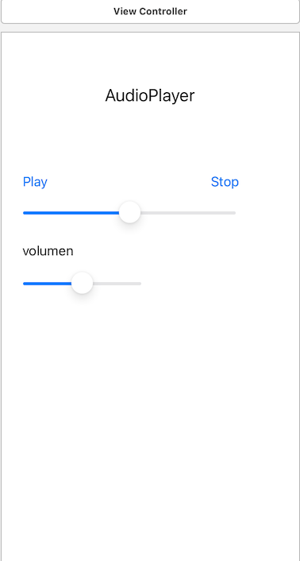
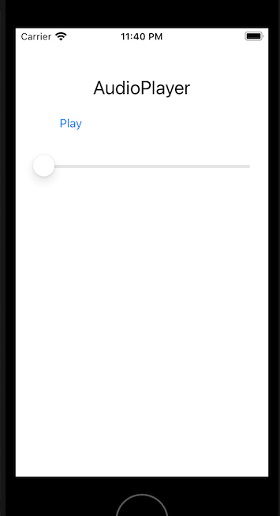

`Desarrollo Mobile` > `Swift Intermedio` 

## Componentes de UIKit

### INTRODUCCIÓN

Para realizar el diseño de la interfaz con el framework UIKit, es necesario conocer los distintos componentes que se pueden colocar en las vistas para poder responder satisfactoriamente a las expectativas de los usuarios.

### OBJETIVO

- Aprender a utilizar algunos de los componentes de UIKit y conectarlos al ViewController.

  

#### REQUISITOS

1. Proyecto terminado del modulo 1.

   

#### DESARROLLO

1.- Como recordaras desde la librería de objetos, puedes arrastrar cualquiera de ellos hacia la vista para crear una instancia del Objeto. Otra posibilidad es crear los objetos directamente en la clase con código Swift. En una vista adicional al Login, recrearemos el sig. Layout. 

- Los objetos que integran la interfaz son (de arriba hacia abajo, izquierda a derecha):
  - UILabel (con el texto AudioPlayer).
  - UIButton (con el texto Play).
  - UIButton (con el texto Stop).
  - UISlider (para controlar la reproducción, adelantar/retroceder).
  - UILabel (con el texto volumen).
  - UISlider (para controlar el volumen).
  
- Para agregar el primer elemento UILabel, agrega el siguiente código en el método viewDidLoad:

  ​	**let** l1=UILabel()

  ​    l1.text="AudioPlayer"

  ​    l1.font=UIFont.systemFont(ofSize: 24)

  ​    l1.autoresizingMask = .flexibleWidth

  ​    l1.translatesAutoresizingMaskIntoConstraints=**true**

  ​    l1.frame=CGRect(x: 0, y: 50, width: **self**.view.frame.width, height: 50)

  ​    l1.textAlignment = .center

  ​    **self**.view.addSubview(l1)

  

- Para agregar el primer elemento UIButton, agrega el siguiente código después del código anterior:

  ​    **let** b1=UIButton(type: .system)

  ​    b1.setTitle("Play", for: .normal)

  ​    b1.autoresizingMask = .flexibleWidth

  ​    b1.translatesAutoresizingMaskIntoConstraints=**true**

  ​    b1.frame=CGRect(x: 20, y: 100, width: 100, height: 40)

  ​    **self**.view.addSubview(b1)

  

- Para agregar el primer elemento UISlider, agrega el siguiente código después del código anterior:

  ​	**let** s1=UISlider ()

  ​    s1.autoresizingMask = .flexibleWidth

  ​    s1.translatesAutoresizingMaskIntoConstraints=**true**

  ​    s1.frame=CGRect(x: 20, y:150, width: **self**.view.frame.width-40, height: 50)

  ​    **self**.view.addSubview(s1)

  

- En este momento la vista se verá como en la siguiente imagen:

  
