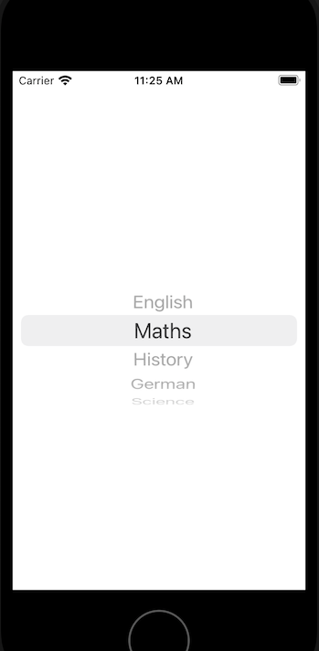

`Desarrollo Mobile` > `Swift Intermedio` 

## Componentes de UIKit que usan delegados

### INTRODUCCIÓN

Para configurar objetos que pueden presentar contenido dinámico como lo es el TableView, es necesario entender el concepto de delegación y la manera en que se implementa este mecanismo en determinados objetos de UIKit.

### OBJETIVO

-  Aprender la manera en que se configura un objeto UIPickerView 
- Identificar como usar delegados con los objetos de la interfaz

#### REQUISITOS

1. Xcode

#### DESARROLLO

El objeto UIPickerView nos permite mostrar al usuario opciones de selección, lo que podría ser el equivalente a un componente "Select" en una página Web. En este ejemplo vamos a colocar y configurar un objeto de este tipo en un nuevo ViewController en tu aplicación actual.

1. Agrega un nuevo ViewController en el StoryBoard y el archivo Swift correspondiente al proyecto. Recuerda vincularlos como se ha hecho anteriormente y establecer este nuevo ViewController como el controller inicial.

2. Agrega el siguiente código en el método viewDidLoad:

  ​	**let** UIPicker: UIPickerView = UIPickerView()

  ​    UIPicker.delegate = **self** **as** UIPickerViewDelegate

  ​    UIPicker.dataSource = **self** **as** UIPickerViewDataSource

  ​    **self**.view.addSubview(UIPicker)

  ​    UIPicker.center = **self**.view.center

  

3. Observa que se produce un error, ya que es necesario que nuestra clase cumpla con los protocolos UIPickerViewDelegate y UIPickerViewDataSource. Confirmar que la clase cumplirá con esos protocolos agregando a la cabecera:

  **class** MiViewController: UIViewController, UIPickerViewDelegate, UIPickerViewDataSource

  

4. Cuando agregamos la especificación de los protocolos, se genera otro error pues hay un par de métodos que es obligatorio implementar. Estos métodos son:

  **func** numberOfComponents(in pickerView: UIPickerView) -> Int

   **func** pickerView(**_** pickerView: UIPickerView, numberOfRowsInComponent component: Int) -> Int

  

  Acepta la sugerencia de Xcode y deja que el esqueleto de esos métodos se agregue a la clase. Los completaremos más tarde

5. Crea un arreglo con los datos que vamos a visualizar

   **let** dataArray = ["English", "Maths", "History", "German", "Science"]

6. Completa y agrega el código siguiente:

    **func** numberOfComponents(in pickerView: UIPickerView) -> Int {

  ​    **return** 1

​	}

​     **func** pickerView(**_** pickerView: UIPickerView, numberOfRowsInComponent component: Int) -> Int {

  ​    **return** dataArray.count

​	}

   **func** pickerView(**_** pickerView: UIPickerView, titleForRow row: Int, forComponent component: Int) -> String? {  

  ​    **let** row = dataArray[row]

  ​    **return** row

}

  

7. El resultado debe ser como en la siguiente imagen:

