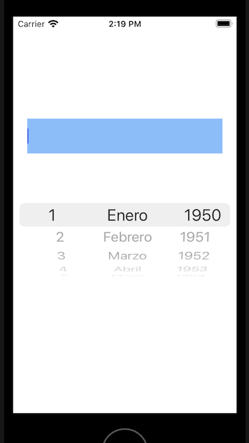
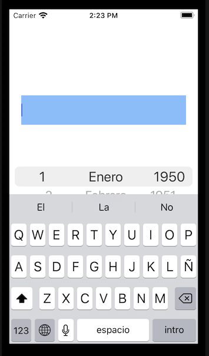
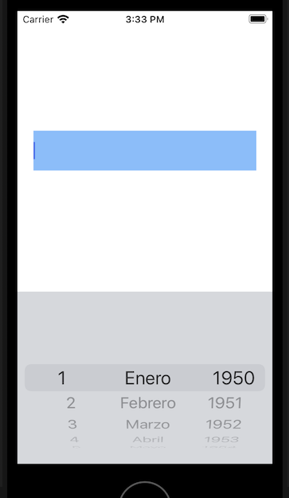

`Desarrollo Mobile` > `Swift Intermedio` 

## Utilizando el objeto UITextField

### INTRODUCCIÓN

Una parte muy importante que debemos considerar es la introducción de datos en el app, que al mismo tiempo que debe ser flexible, tiene que permitir la validación intrínseca de la información que requerimos por parte del usuario del App.

### OBJETIVO

- Utilizar los métodos delegados del objeto UITextField para mejorar la experiencia de usuario.

#### REQUISITOS

1. Reto-02 completado o en su defecto Ejemplo-02.

#### DESARROLLO

En nuestra app, agregaremos un objeto UITextField, que quede colocado arriba del PickerView que tenemos.

1. Agrega una property de tipo UITextField a la clase:

   ​    **var** textField:UITextField!

   

2. Y luego, colocamos este código en el método viewDidLoad, debajo del código que crea el PickerView:

   ​	textField = UITextField()

   ​    **self**.view.addSubview(textField)

   ​    textField.backgroundColor = UIColor.systemBlue.withAlphaComponent(0.5)

   ​    textField.translatesAutoresizingMaskIntoConstraints = **false**

   ​    textField.centerXAnchor.constraint(equalTo: view.centerXAnchor).isActive = **true**

   ​    textField.topAnchor.constraint(equalTo:**self**.view.topAnchor, constant: 150).isActive = **true**

   ​    textField.leadingAnchor.constraint(equalTo: view.leadingAnchor, constant: 20).isActive = **true**

   ​    textField.trailingAnchor.constraint(equalTo: view.trailingAnchor, constant: -20).isActive = **true**

   ​    textField.heightAnchor.constraint(equalToConstant: 50).isActive = **true**

   

   El resultado debe ser igual que en esta imagen:

   

3. Al presionar dentro del cuadro de texto, en automático aparece el teclado, lo cual nos causa un problema en la interfaz:

   

4. En este caso vamos a implementar un comportamiento que es bastante común en las Apps. Supongamos que necesitamos que el usuario introduzca un dato restringido (en este caso es una fecha, pero podría ser un estado de la república, o una marca de autos, etc). Si solamente colocamos el cuadro de texto, después tendríamos que implementar la validación del texto introducido, lo cual nos llevaría a mayores complicaciones. Lo que se acostumbra hacer, es utilizar los cuadros de texto como el objeto de entrada de datos, pero si queremos controlar estrictamente lo que introduce el usuario, no le mostraremos el teclado sino un objeto PickerView, para que solo pueda elegir entre un conjunto determinado de opciones. Para esto, en primer lugar debemos especificar que el cuadro de texto utilizará una vista de entrada que no es la entrada estándar, para desaparecer el teclado.

   ​	textField.inputView = UIPicker

   

5.  Ahora especificamos que el objeto UIPickerView no debe aparecer en la vista, comentando el siguiente código:

   //    self.view.addSubview(UIPicker)

   //    UIPicker.center = self.view.center

   

6. De esta forma, al ejecutar nuevamente el app, debemos ver solo el cuadro de texto, y luego de que se toque dentro de él como para empezar a escribir, deberémos ver aparecer el objeto UIPickerView en vez del teclado, tal como en esta imagen:

   

   

7. Ahora el problema es que no podemos desaparecer el PickerView, esto es porque el cuadro de texto nunca pierde el foco. Otro comportamiento esperado por los usuarios de Apps es que al tocar "el fondo" de la vista se desaparezca cualquier elemento de entrada (ya sea el teclado o una vista personalizada como en este caso). Para que esto ocurra, solo debemos agregar el siguiente código a nuestra clase:

   **override** **func** touchesBegan(**_** touches: Set<UITouch>, with event: UIEvent?) {

   ​    **self**.view.endEditing(**true**)

     }

   

8. Ahora solo debemos implementar el llenado del cuadro de texto cuando el usuario elija una fecha, asi que para eso vamos a implementar este método del protocolo UIPickerViewDelegate:

    **func** pickerView(**_** pickerView: UIPickerView, didSelectRow row: Int, inComponent component: Int)

   

   De esta manera:

**func** pickerView(**_** pickerView: UIPickerView, didSelectRow row: Int, inComponent component: Int) {

   ​    **let** indice1 = pickerView.selectedRow(inComponent: 0)

   ​    **let** indice2 = pickerView.selectedRow(inComponent: 1)

   ​    **let** indice3 = pickerView.selectedRow(inComponent: 2)

   ​    **let** dia = diasArray[indice1]

   ​    **let** anio = aniosArray[indice3]

   ​    **let** dateFormatter = DateFormatter()

   ​    dateFormatter.dateFormat = "dd/MM/yyyy"

   ​    **if** **let** date = dateFormatter.date(from: "\\(dia)/\\(indice2 + 1)/\\(anio)") {

   ​      textField.text = dateFormatter.string(from: date)

   ​    }

}

Analiza este código. ¿Lo comprendes bien? ¿Crees que hay una mejor manera de implementar esta funcionalidad?

