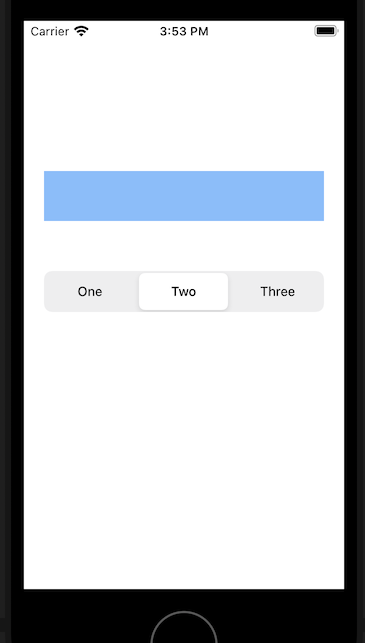

`Desarrollo Mobile` > `Swift Intermedio` 

## Agregando funcionalidades a los controles

### INTRODUCCIÓN

Una vez que se agregan los controles a la vista, es necesario que esos controles tengan la programación necesaria para que respondan apropiadamente a los eventos causados por el usuario.

### OBJETIVO

- Aprender como hacer la implementación de selectores en los controles agregados programáticamente.

#### REQUISITOS

1. Ejemplo-03 completado

#### DESARROLLO

En nuestra app, agregaremos un objeto UISegmentedControl en la vista, debajo del cuadro de texto.

1. Agrega este código en el método viewDidLoad:

   ​	**let** mySegmentedControl = UISegmentedControl (items: ["One","Two","Three"])

   ​    **self**.view.addSubview(mySegmentedControl)

   ​    mySegmentedControl.translatesAutoresizingMaskIntoConstraints = **false**

   ​    mySegmentedControl.centerXAnchor.constraint(equalTo: view.centerXAnchor).isActive = **true**

   ​    mySegmentedControl.topAnchor.constraint(equalTo:textField.bottomAnchor, constant: 50).isActive = **true**

   ​    mySegmentedControl.leadingAnchor.constraint(equalTo: view.leadingAnchor, constant:20).isActive = **true**

   ​    mySegmentedControl.trailingAnchor.constraint(equalTo: view.trailingAnchor, constant:-20).isActive = **true**

   ​    mySegmentedControl.heightAnchor.constraint(equalToConstant: 40).isActive = **true**

   ​    mySegmentedControl.selectedSegmentIndex = 1

   

   Cuando ejecutes el App en el simulador de tu preferencia, el resultado debe ser como en la imagen:

   

   

2. Ahora agregamos este código para que cuando el usuario cambie de segmento, se pueda ejecutar alguna acción:

   mySegmentedControl.addTarget(**self**, action: **#selector**(**self**.segmentedValueChanged(**_**:)), for: .valueChanged)

   

3.  Verás que Xcode muestra un error:

   "Value of type 'MiViewController class' has no member 'segmentedValueChanged' "

   

   Para entender la causa del error, analicemos el método "addTarget". Este método es común a todos los objetos que pueden recibir eventos (todos los que heredan de UIControl) y nos permite asignar un objeto de destino y un método de acción para algun evento en el control:

   - El objeto de destino es el objeto cuyo método de acción se llama. En este caso asignamos "self" porque queremos ejecutar un método en esta misma clase.

   - La acción se especifica con la sintaxis de "selector" que es heredada de Objective-C.  En Objective-C, un selector es un tipo que hace referencia al nombre de un método de Objective-C. En Swift, los selectores de Objective-C están representados por la estructura Selector, y se crean utilizando la expresión #selector, que identifica el método que se va a llamar. 

   - Evento del control. Especifica el evento de control para el que se llama al método de acción. Para ver una lista de posibles valores, consulte UIControl.Event: 

     https://developer.apple.com/documentation/uikit/uicontrol/event

     

     La referencia completa del método la puedes consultar aqui:

     https://developer.apple.com/documentation/uikit/uicontrol/1618259-addtarget

4. Entonces, necesitamos agregar el método **segmentedValueChanged** a nuestra clase, para que se invoque cuando el valor del control UISegmentedControl cambie. Agrega este código después del método viewDidLoad:

     **@objc** **func** segmentedValueChanged(**_** sender:UISegmentedControl!) {

   ​    print("El Segmento Seleccionado es : \(sender.selectedSegmentIndex)")

     }

    

   En Swift el enfoque normal es vincular las llamadas y los cuerpos de los métodos en tiempo de compilación (como hacen C y C++). Objective C lo hace en tiempo de ejecución. Así que en Objective C puedes hacer algunas cosas que no son posibles en Swift - por ejemplo, es posible intercambiar la implementación del método en tiempo de ejecución (se llama swizzling del método). Cocoa fue diseñado para trabajar con el enfoque de Objective C y esta es la razón por la que tienes que informar al compilador que tu método Swift debe ser compilado en estilo Objective-C. 

   (Se revisará más ampliamente el tema de la interacción entre Swift y Objective-C en la sesión 7)

   

5.  Ejecuta el app en tu simulador preferido. Al cambiar el segmento seleccionado debes ver en el panel de depuración algo asi:

   **El Segmento Seleccionado es : 2**

   **El Segmento Seleccionado es : 0**

   **El Segmento Seleccionado es : 1**

   

Analiza este código. ¿Lo comprendes bien? Si tienes cualquier duda consulta al experto, ¡porque lo utilizaremos en el siguiente reto!

