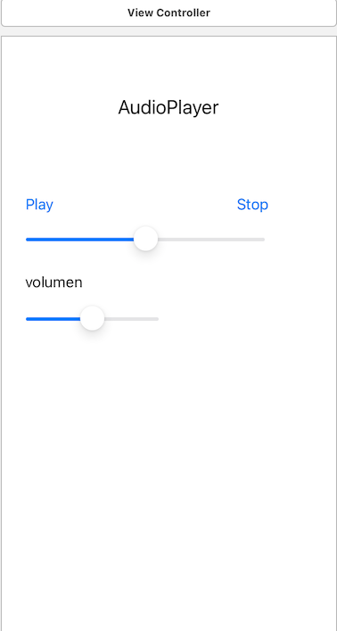

 `Desarrollo Mobile` > `Swift Intermedio` 
	
## Integrando mas componentes de UIKit

### OBJETIVO 

- Agregar más controles al **Ejemplo-01**

#### REQUISITOS 

1. Haber concluido el Ejemplo-01 de componentes de UIKit.

#### DESARROLLO

Ya sabes mostrar elementos en una Vista. Es momento de agregar el código necesario para presentar los elementos restantes 

1. Agregar otro botón al lado contrario del primero
2. Agregar el segundo slider y su etiqueta "volumen". 
3. Al finalizar el reto la interfaz debe verse como en la imagen:



<details>
        <summary>Solución</summary>
<p>  Dentro de MainViewController debemos tener los elementos de UIKit: titleLabel, mapView, tableView. </p>
<p>  Se debe contar con un array para almacenar los nombres de las ubicaciones. </p>


```
        let b2=UIButton(type: .system)
        b2.setTitle("Stop", for: .normal)
        b2.autoresizingMask = .flexibleWidth
        b2.translatesAutoresizingMaskIntoConstraints=true
        b2.frame=CGRect(x:self.view.frame.width-100, y: 100, width: 100, height: 40)
        self.view.addSubview(b2)
        
        let l2=UILabel()
        l2.text="Volumen"
        l2.autoresizingMask = .flexibleWidth
        l2.translatesAutoresizingMaskIntoConstraints=true
        l2.frame=CGRect(x: 20, y: 200, width: 100, height: 40)
        self.view.addSubview(l2)

        let s2=UISlider()
        s2.autoresizingMask = .flexibleWidth
        s2.translatesAutoresizingMaskIntoConstraints=true
        s2.frame=CGRect(x: 20, y: 250, width: self.view.frame.width/2, height: 50)
        self.view.addSubview(s2)
```

</details>
