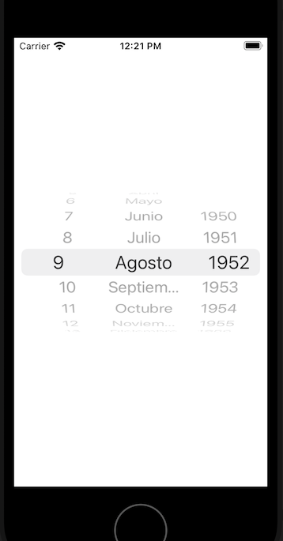

`Desarrollo Mobile` > `Swift Intermedio` 
	

## Agregando componentes a un UIPickerView 

### OBJETIVO 

- Una vez que ya hemos agregado un objeto UIPickerView a la UI de la app, el alumno deberá poder determinar como agregar más componentes al mismo. 

#### REQUISITOS 

0. Xcode
1. Ejemplo-02 concluido, servirá de base para este reto.

#### DESARROLLO

1. Analiza el código del Ejemplo anterior, y determina para qué se ocupa cada uno de los métodos delegados del objeto UIPickerView

2. UIKit incluye un objeto UIDatePicker que es una especialización de PickerView para poder mostrar fechas y horas. ¿Qué código necesitarías implementar para poder mostrar un PickerView como el de la siguiente imagen?

   



<details>
	<summary>Solución</summary>
	<p>La funcionalidad del Switch para mostrar el camino entre pines: </p>

```
     let dataArray = ["English", "Maths", "History", "German", "Science"]
    // Declaramos los arreglos que se utilizarán para llenar el PickerView
    let mesesArray = ["Enero", "Febrero", "Marzo", "Abril", "Mayo", "Junio", "Julio", "Agosto", "Septiembre", "Octubre", "Noviembre", "Diciembre"]
    // Estos dos arreglos los llenaremos con un ciclo por facilidad
    var diasArray = [String]()
    var aniosArray = [String]()
    
		override func viewDidLoad() {
        super.viewDidLoad()
        // llenamos el arreglo de días con números como String
        for d in 1...31 {
            diasArray.append(String(d))
        }
        // llenamos el arreglo de años con números como String
        for a in 1950...2021 {
            aniosArray.append(String(a))
        }
        let UIPicker: UIPickerView = UIPickerView()
        UIPicker.delegate = self as UIPickerViewDelegate
        UIPicker.dataSource = self as UIPickerViewDataSource
        self.view.addSubview(UIPicker)
        UIPicker.center = self.view.center
 		}
 
 
    // metodos requeridos de UIPickerViewDelegate y UIPickerViewDataSource
    func numberOfComponents(in pickerView: UIPickerView) -> Int {
       return 3 // 3 "columnas": dia, mes y año de la fecha
    }
    
    func pickerView(_ pickerView: UIPickerView, numberOfRowsInComponent component: Int) -> Int {
        // es necesario evaluar que "columna" se está configurando para determinar cuantos elementos hay que presentar, es decir, que arreglo se usará
        if component == 0 {
            return diasArray.count
        }
        if component == 1 {
            return mesesArray.count
        }
        
        return aniosArray.count
    }
    
    func pickerView(_ pickerView: UIPickerView, titleForRow row: Int, forComponent component: Int) -> String? {
        // es necesario evaluar que "columna" se está configurando para determinar de que arreglo tomar el String
        var rowStr = aniosArray[row]
        if component == 0 {
            rowStr = diasArray[row]
        }
        if component == 1 {
            rowStr = mesesArray[row]
        }
       return rowStr
    }
```

</details> 

