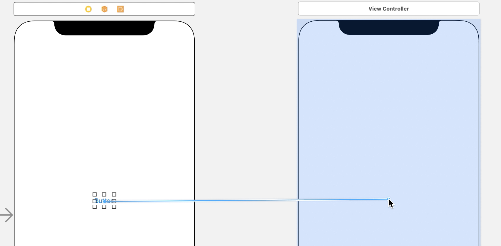
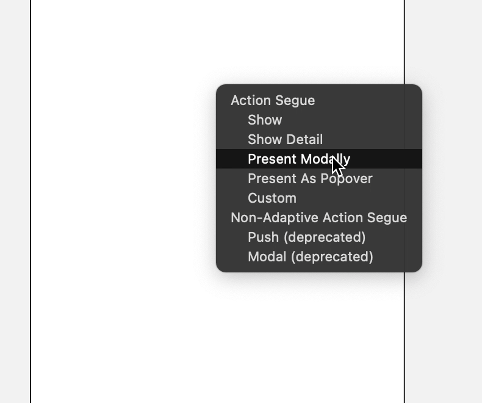
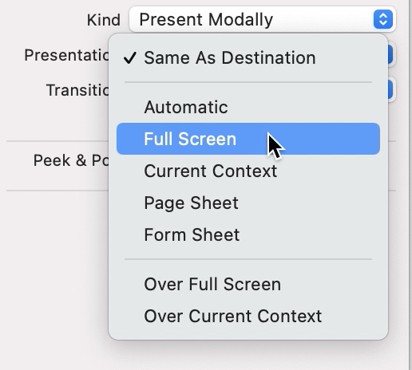
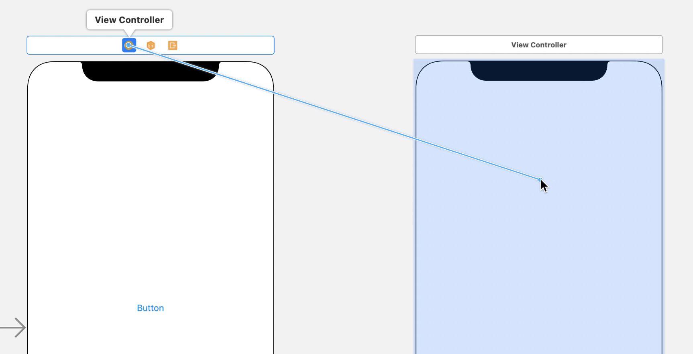
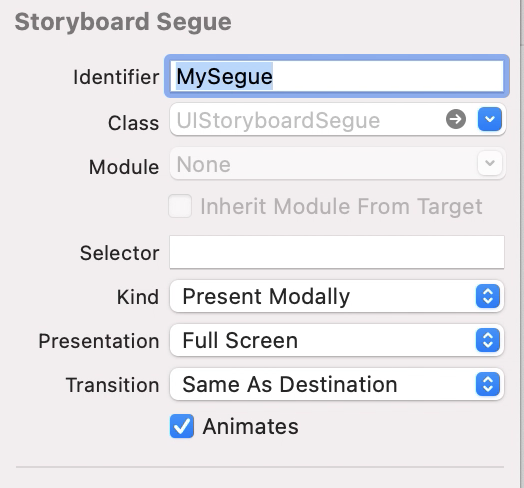
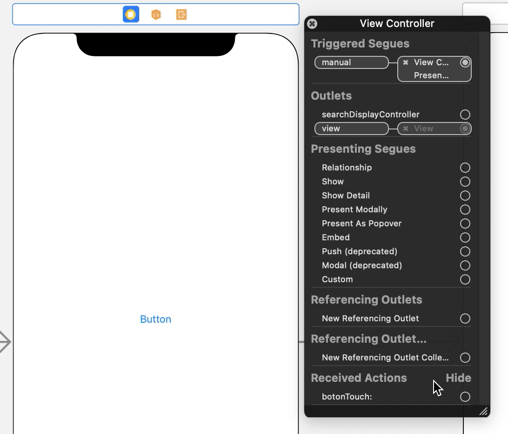
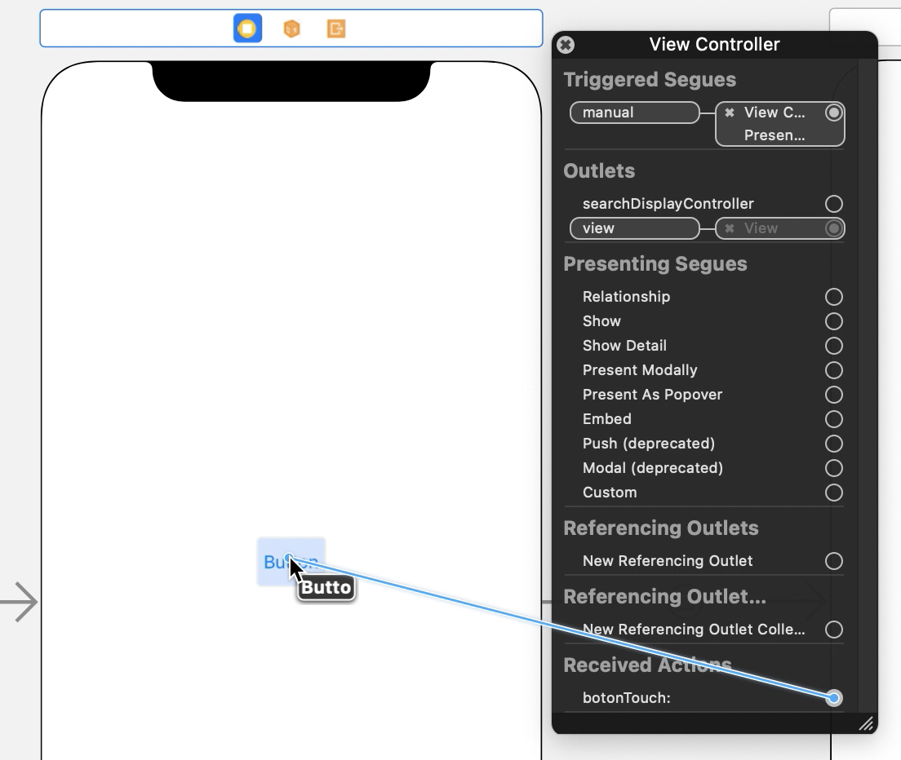
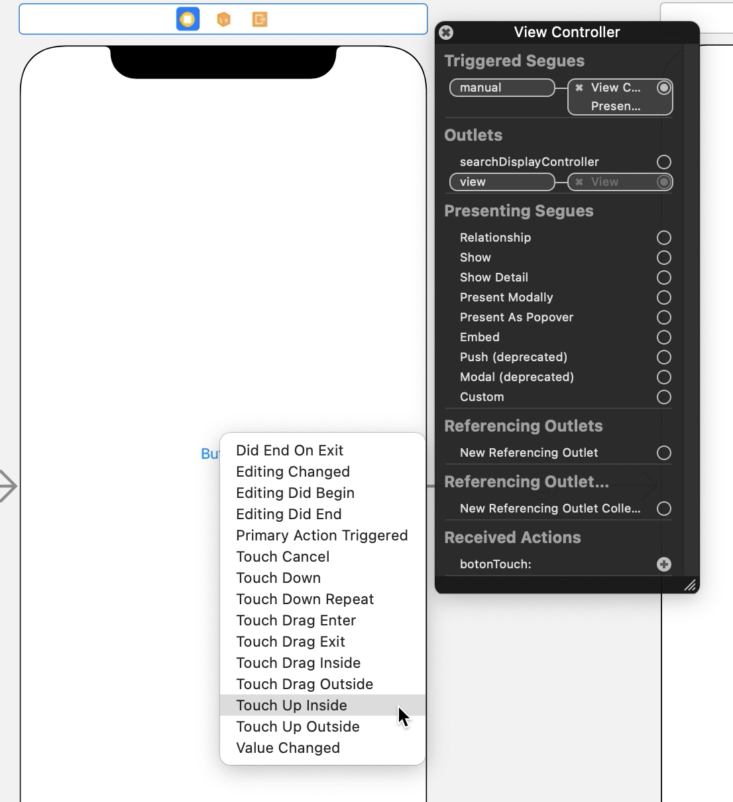

`Desarrollo Mobile` > `Swift Intermedio` 

## Modal views

### INTRODUCCIÓN

El paradigma de navegación más simple y más frecuentemente utilizado es cuando "reemplazamos" la vista actual con la nueva. A este mecanismo se le conoce como **Vista Modal**.

### OBJETIVO

- Conocerá la forma de implementar la navegación entre vistas de forma modal.

#### REQUISITOS

1. Xcode

#### DESARROLLO

En esta sesión nos enforamemos en la forma de presentar un ViewController sobre otro ViewController. 

1. Implementar la navegación con código.

Como se vio en la sesión anterior, la clase UIViewController define los métodos para presentar un segundo objeto ViewController sobre si misma, esto lo ponemos en práctica al presentar un Alert en nuestra app, y de la misma manera podemos presentar cualquier otro ViewController. Como se recordará el método en cuestion es: 

 **self**.present(alert, animated: **true**, completion: **nil**)

Este método se puede utilizar con cualquier instancia de ViewController como se muestra en el ejemplo siguiente:

 	 **let** otherController = OtherViewController()

​      **self**.present(otherController, animated: **false**, completion: **nil**)

Este método present esta directamente relacionado con otro método tambien definido en la clase UIViewController que nos permite remover un ViewController de la jerarquía de vistas:

 **self**.dismiss(animated: **true**, completion: **nil**)

Supongamos que tenemos dos ViewControllers en el app, llamemosles ViewController1, ViewController2. Si queremos presentar ViewController2 sobre ViewController1, en ViewController1 debemos implementar el código que instancíe ViewController2 e invoque al metodo **present** como se explico anteriormente. Para completar la navegación dando al usuario la posibilidad de regresar de ViewController2 a ViewController1, en ViewController1 debemos implementar el metodo **dismiss**. 

2. Definir segues en el StoryBoard.

Otra manera de implementar la navegación es utilizando directamente el StoryBoard para conectar dos ViewControllers previamente colocados en él:

- En la libreria busca y selecciona el objeto UIButton.

- Una vez seleccionado el objeto, de la libreria arrastralo y colocalo en el ViewController1.

- Una vez en el ViewController1, utiliza el clic y la tecla control para arrastrar desde el Button hasta tocar el ViewController2. Debe verse como se forma una linea como se ve en la imagen:

  

  

- Desde el menú contextual selecciona Present modally, como se muestra en la siguiente imagen:

  

- Aparecera una linea conectando ambos ViewControlers, a esta linea le llamamos segue. Selecciona el segue que se acaba de crear y en el panel de inspección selecciona Presentation y elige la opcion Full Screen, como se muestra en la siguiente imagen:

- De esta forma en el momento en que el usuario toque el botón se producira la navegación anteriormente descrita sin necesidad de agregar ninguna linea de código.

  

3. Navegación ejecutando segues con código Swift.

En ocasiones la navegación no puede ser automática como se describió en el punto número 2 si no que puede depender de la ejecución previa de algun código, para esto podemos crear los segues en el StoryBoard pero no conectarlos a un objeto si no directamente al FileOwner como se muestra en la siguiente imagen:

- Posteriormente en el menú contextual selecciona Present Modaly, al hacer esto, aparecera el segue conectando ambos ViewControlers, seleccionalo y en el panel de inspección selecciona Presentation y elige la opcion Full Screen como se hizo en el ejemplo anterior.

- En el panel de inspección selecciona Identifier y asignale un identificador que te permita reconocer el segue, como se muestra en la siguiente imagen:

  

- En el panel de navegación selecciona el archivo ViewControler.swift y escribe el siguiente código: 

  **@IBAction** **func** botonTouch(**_** sender:UIButton){

  ​    **self**.performSegue(withIdentifier: "MySegue", sender: **self**)

     

    }

  

- Posteriormente, en el panel de navegación regresa al archivo Main.storyboard, una vez en el archivo usa el click secundario para seleccionar el FileOwner del ViewController1, para abrir el menú contextual como se muestra en la siguiente imagen:

  

- En el menú contextual selecciona botonTouch, que corresponde al action definido por el código que escribimos en el paso anterior, y arrastralo hacia el objeto UIButton que se encuentra en el ViewController1 como se muestra a continuación:

  

- Al hacer esto aparecera un menú con los eventos disponibles en la vista, en este menú  selecciona la opción **Touch Up Inside** como se muestra en la siguiente imagen:

  

Despues de implementar cualquiera de estos ejemplos ejecuta el app en el simulador de tu preferencia.
