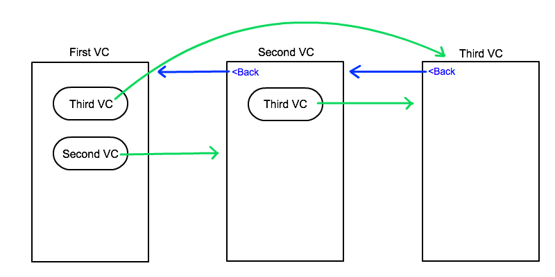
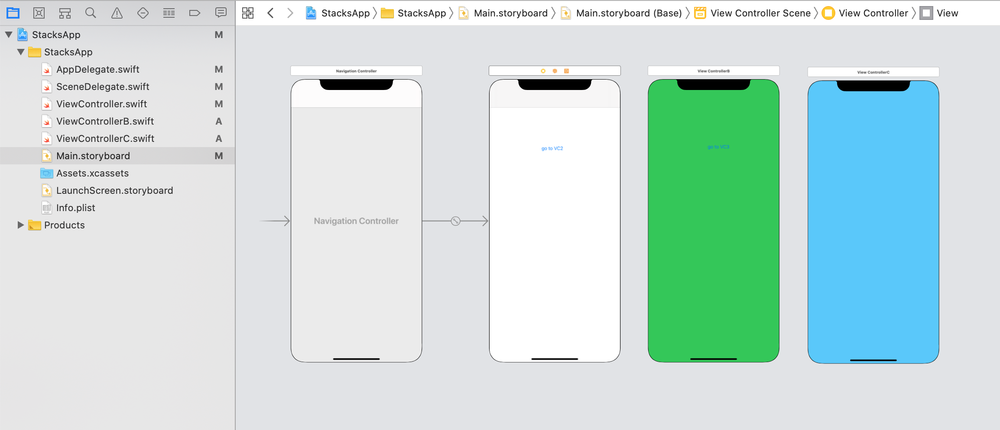

`Desarrollo Mobile` > `Swift Intermedio` 

## UINavigation Controller, navigation stack

### INTRODUCCIÓN

El concepto de **Breadcrumb Navigation** que es muy común en los sitios web, tiene su equivalencia en un App con el objeto NavigationController. Este concepto de navegación ayuda a los usuarios a entender fácilmente la relación entre su ubicación en una vista y las vistas de nivel superior

### OBJETIVO

- Aprender como funciona el sistema de stacks al presentar una vista.

#### REQUISITOS

1. Xcode

#### DESARROLLO

En esta sesión nos enfocaremos en el Navigaton Stack. Un objeto de tipo navigation controller maneja sus vistas utilizando un Array, conocido como navigation stack.

El primer view controller en el array es el **Root** View Controller y representa el stack que esta *mas al fondo*. El último VC en el array, él que esta mas por encima de todos y representa el ViewController que será mostrado, a este VC se le conoce como **the topmost item**.



#### Como enviar un ViewController al Top del Navigation Stack

Partiendo de la vista correspondiente a **ViewControllerA** pasaremos a un nuevo VC, **ViewControllerB**.

1. Crearemos un nuevo proyecto Xcode:
   - Agrega un botón en el ViewController, con el texto "go to VC2" 
   - Agrega otro ViewController al Storyboard y cambia el color de fondo de la vista a verde.
   - Agrega un botón en este ViewController, con el texto "go to VC3" 
   - Agrega otro ViewController al Storyboard y cambia el color de fondo de la vista a azul.
   - Crea dos clases (archivos .swift) que hereden de UIViewController. Asegurate de vincularlas a los correspondientes objetos en el Storyboard
   - Agregar un objeto NavigationController desde la librería, observa que este objeto tiene como rootViewController un objeto tipo UITableViewController. Elimínalo y conecta el ViewController que era el inicial, como rootViewController del navigation.
   - Configura el NavigationController como "Initial ViewController".
   - El Storyboard debe verse como en la imagen.



2. Mediante un **Push** navegaremos del `VC1 -> VC2`.

```
let storyBoard : UIStoryboard = UIStoryboard(name: "Main", bundle:nil)
let viewControllerB = storyBoard.instantiateViewController(withIdentifier: "VC2") as! ViewControllerB  
self.navigationController?.pushViewController(viewControllerB, animated: true)
```

Ahora tenemos dos VC en el Stack, el VC2 es el **topmost item**.

#### Como reemplazar un ViewController en el Stack

Ahora que tenemos un stack de VC, podemos manipular un poco el orden.

Agregaremos un tercer VC, este viewController reemplazará la posición del VC2.

3. Creamos una instancia de VC3:

```
let storyBoard : UIStoryboard = UIStoryboard(name: "Main", bundle:nil)
let viewControllerC = storyBoard.instantiateViewControllerWithIdentifier("VC3") as! ViewControllerC
```

4. Obtenemos la lista de VC.

```
var stack = self.navigationController?.viewControllers
```

5. Removemos el último VC, el correspondiente a VC2.

```
stack!.removeLast()
```

6. Agregamos el VC a nuestro Stack.

```
stack!.append(viewControllerC)
```

7. Pasamos el stack al navigation controller.

```
self.navigationController?.setViewControllers(stack!, animated: true)
```

Ahora veamos todo el código en un solo `IBAction`:

```
@IBAction func buttonAction(_ sender: Any) {
let storyBoard : UIStoryboard = UIStoryboard(name: "Main", bundle:nil)
let viewControllerC = storyBoard.instantiateViewController(withIdentifier: "VC3") as! ViewControllerC
var stack = self.navigationController?.viewControllers
stack!.removeLast()
stack!.append(viewControllerC)
self.navigationController?.setViewControllers(stack!, animated: true)
}
```

#### Como pasar al ViewControllerC y convertirlo en el RootViewController

1.  Para lograr esto, necesitamos hacer que el RootViewController sea el ViewControllerC, haciendo este VC el primero en el Stack.

```
private func removeAll() {
let storyBoard : UIStoryboard = UIStoryboard(name: "Main", bundle:nil)
let viewControllerC = storyBoard.instantiateViewController(withIdentifier: "VC3") as! ViewControllerC
var stack = self.navigationController?.viewControllers
stack!.removeAll()
stack!.append(viewControllerC)
self.navigationController?.setViewControllers(stack!, animated: true)
}
```

#### Resultados

Navegando al VC2 y al regresar nos saltamos al VC3:


Navegando hasta el VC3, regresamos al RootViewController.


