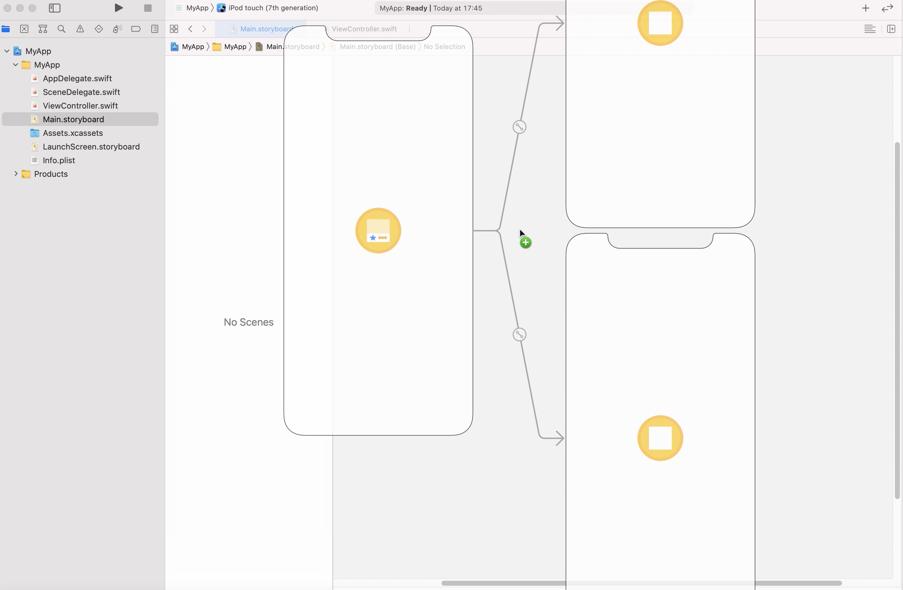
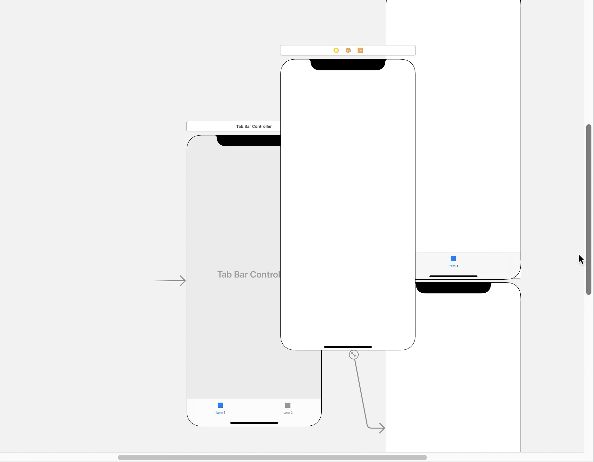
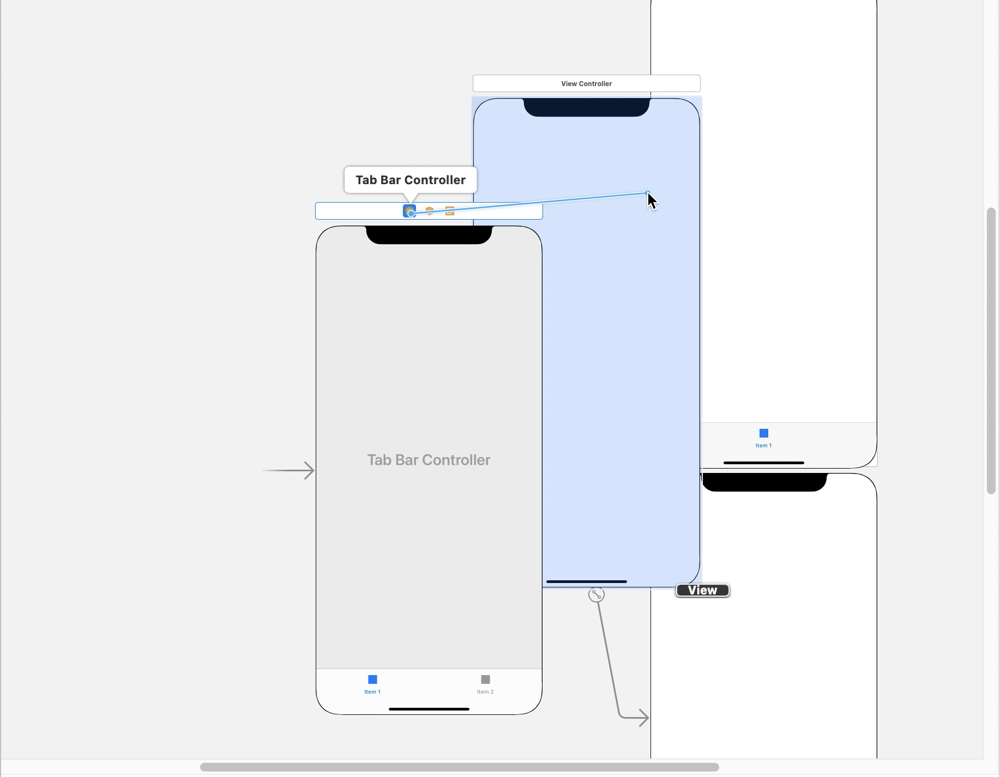
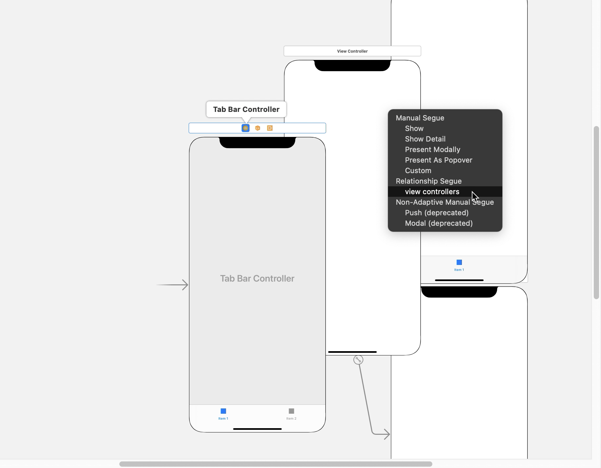
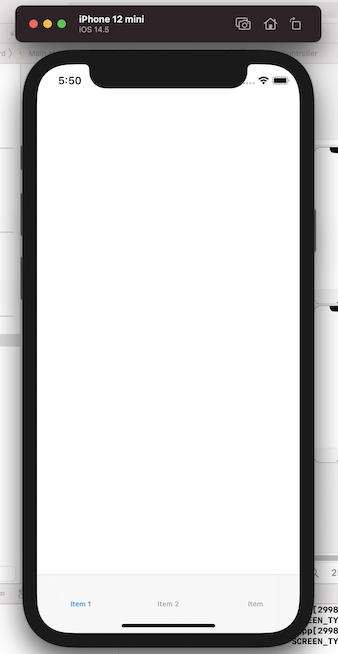

`Desarrollo Mobile` > `Swift Intermedio` 

## Navegación utilizando el objeto UITabBar

### INTRODUCCIÓN

El paradigma de navegación de "pestañas" es muy utilizado en el desarrollo de software. Esta implementación permitirá que se pongan a disposición del usuario varias vistas para que se pueda cambiar de una a otra sin necesidad de que se establezca una Stack de vistas como en el caso del NavigationController.

### OBJETIVO

- Aprendera como mostrar diferentes ViewControllers utilizando el contenedor TabBar.

#### REQUISITOS

1.- Xcode 

#### DESARROLLO

- Busca en la libreria el objeto TabBarController y arrastralo al Main.storyboard como se muestra en la siguiente imagen:

- Asegurate de que el objeto TabBar sea el Initial ViewController. Ejecuta el app en el simulador de tu preferencia y observa cual es el resultado.

- En la libreria busca el objeto ViewController y arrastralo al archivo Main.storyboard. Ubicalo cerca del TabBar pero de manera que puedas verlo, no importa si queda encima de otro ViewController. Como se observa en la siguiente imagen:

  

- Crea un segue desde el FileOwner del TabBarController hacia el nuevo ViewControler, como se explico en el ejemplo 1, el resultado se muestra a continuación:

  

- Al hacer esto aparecera un menú contextual, en el menu, busca el apartado de Relationship Segue y selecciona la opcion view controllers, como se puede ver en esta imagen: 

  

- Es recomendable organizar tus ViewControllers para tener una vista más organizada del flujo de tu aplicación. Ejecuta el proyecto en el simulador de tu preferencia y el resultado debe ser como el que se muestra en la siguiente figura:

  
