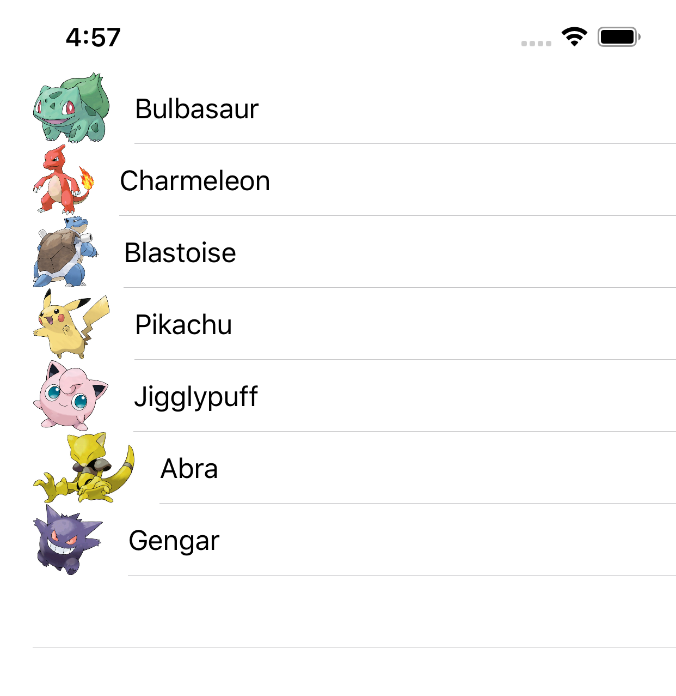
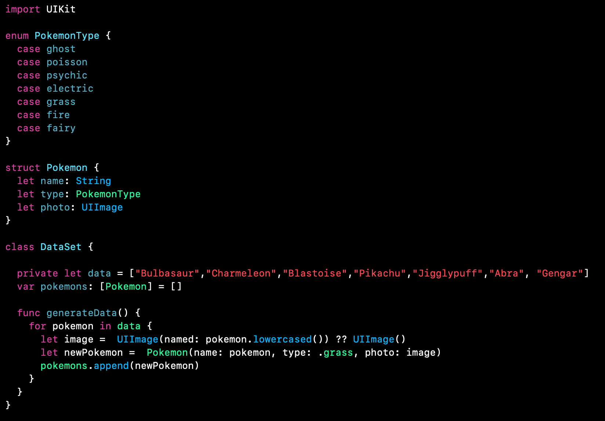
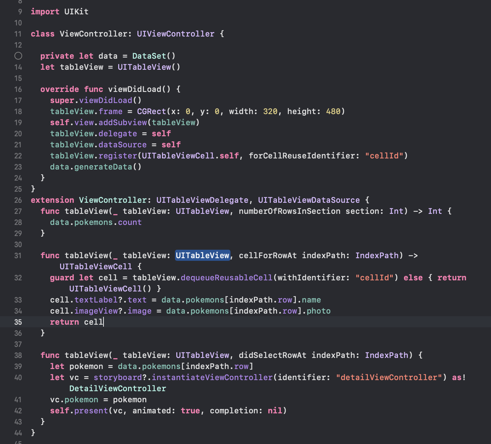
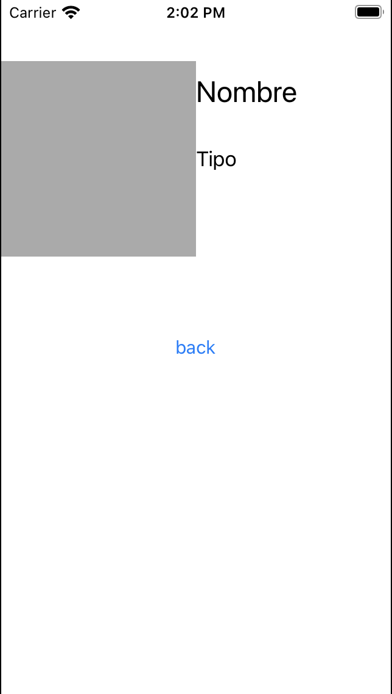
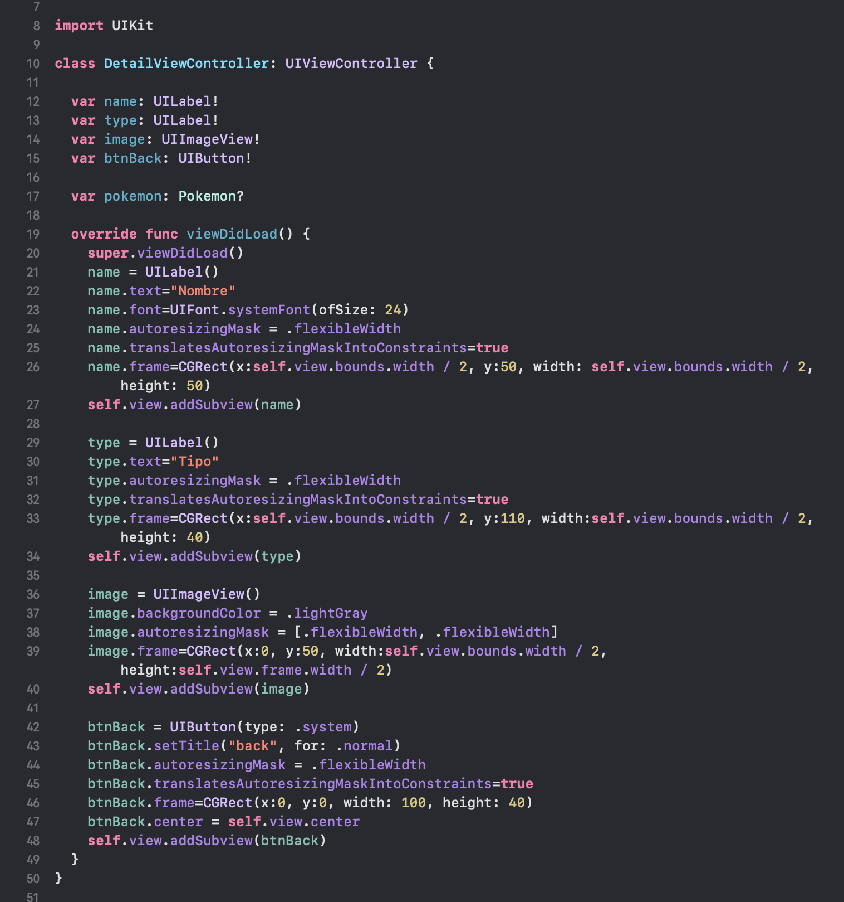
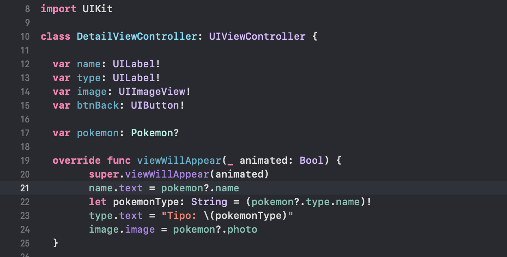
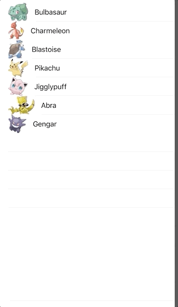

`Desarrollo Mobile` > `Swift Intermedio` 

## Pasando datos entre ViewControllers

### OBJETIVO

- Aprender a pasar información entre diferentes vistas de navegación.

#### REQUISITOS

1. Xcode
2. Comprender la implementación de TableViews y NavigationController.

#### DESARROLLO

En este ejemplo veremos como enviar datos a una vista de detalle. Se presentará un TableView como este: 



Y cuando el usuario seleccionara un TableViewcell, en la vista de detalle veremos la info correspondiente al elemento seleccionado.

1.- Comenzamos creando un nuevo proyecto de Xcode. En el código de ViewController agregaremos un TableView a la vista, con el siguiente código en viewDidLoad:

**override** **func** viewDidLoad() {

  **super**.viewDidLoad()

  tableView.frame = CGRect(x: 0, y: 0, width: 320, height: 480)

  **self**.view.addSubview(tableView)

  tableView.delegate = **self**

  tableView.dataSource = **self**

  tableView.register(UITableViewCell.**self**, forCellReuseIdentifier: "cellId")

  data.generateData()

 }

2.- Crearemos una clase  `DataModel`, esta clase se encargará de tener la información a mostrar.
Para ello nos apoyaremos de usos de Enums y Structs. Ejemplo:



3.- Regresando a nuestro ViewController principal (en donde esta nuestro TableView), mostraremos esta data del modelo de la sig. manera.



4.- En el proyecto agregaremos un archivo de Clase .swift. llamado "DetailViewController". En este archivo implementaremos el sig. Layout. 



Con este código:



6.- Ya aprendimos a agregar funcionalidad  a los objetos que colocamos en la vista con código, entonces agregamos el código necesario para hacer **Pop/Dismiss**, como respuesta al evento touch del botón back.

Agrega esta línea en viewDidLoad:

btnBack.addTarget(**self**, action: **#selector**(**self**.back(**_**:)), for:.touchUpInside)


y luego agrega este método a la clase:

  **@objc** **func** back(**_** sender: **Any**) {

   **self**.dismiss(animated: **true**, completion: **nil**)

  }

7.- En el método viewWillAppear, asignaremos los datos recibidos. Para poder recibir datos del TableView debemos primero identificar que Tipo de Dato necesitamos.

En este caso estamos utilizando una Estructura de tipo *Pokemon*, entonces en nuestra vista de detalle utilizaremos una variable de tipo *Pokemon*. Luego asignaremos los valores correspondientes a nuestros Objetos.



8.- Implementamos en la vista principal donde tenemos el TableView la funcion de ir a la vista de detalle al seleccionar una celda. Para ello pasamos la variable Pokemon.

```
  func tableView(_ tableView: UITableView, didSelectRowAt indexPath: IndexPath) {
    let pokemon = data.pokemons[indexPath.row]
    let vc = storyboard?.instantiateViewController(identifier: "detailViewController") as! DetailViewController
    vc.pokemon = pokemon
    self.present(vc, animated: true, completion: nil)
  }
```

9.- Resultado Final.




