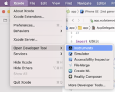
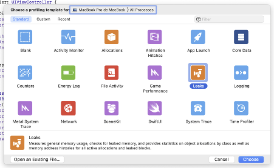
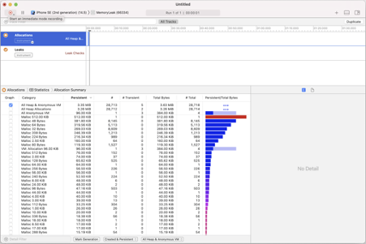
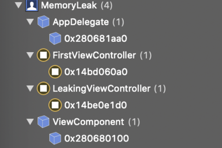

`Desarrollo Mobile` > `Swift Intermedio` 

#### **POSTWORK**

#### Sesión 06

### **Manejo de memoria**

#### **🔎** **Introducción**

En este postwork se revisarán los conceptos vistos en la sesión sobre el manejo de memoria en nuestra App, así como también los modificadores que tiene el lenguaje para el trabajo con variables locales.

 #### **Objetivos**

●   Reconocer los procesos de manejo de memoria cuando hay una fuga de la misma en un App iOS.
●   Utilizar adecuadamente los modificadores de referencia de las variables.

#### **Desarrollo:**

En este Postwork se trabajará con el manejo de memoria en nuestra App, así como los modificadores que tiene el lenguaje para el trabajo con variables locales. Así, se producirá e identificará una fuga de memoria utilizando el instrumento de depuración de memoria de Xcode.

#### **Asegúrate de comprender:**

1. Cómo se administra la memoria en un App iOS
2. Cómo se modifican las referencias a variables. 
3. Qué eventos se desencadenan en las interacciones del usuario con una vista del App

#### **Indicaciones generales:**

●   Descarga el proyecto Xcode de ejemplo del siguiente repositorio:

[Modulo2 - Postwork Sesión6](https://github.com/beduExpert/Swift-Proyecto/tree/main/M%C3%B3dulo-02/Sesi%C3%B3n-06) 

●   Analiza la aplicación de ejemplo:

○   Tenemos dos pantallas. En la primera pantalla, una simple subclase UIViewController, todo lo que hace es presentar un botón, al tocarlo, nos permite navegar a la segunda pantalla 

○   Nuestro ViewController con memory leaks es la segunda pantalla, aquí hemos creamos intencionalmente una fuga de memoria utilizando un Retain Cycle. 

○   Para crear un ciclo de retención, tenemos una clase ViewComponent que toma un UIViewController como parámetro. Como resultado, tenemos la siguiente relación:

​          LeakingViewController ➼ ViewComponent

​          ViewComponent ➼ LeakingViewController

 

○   Para que un objeto sea liberado de la memoria, ningún otro objeto debe estar apuntando o reteniéndolo, lo cual, por supuesto, no es lo que sucede en nuestro ejemplo.

 

Para diagnosticar la fuga de memoria, este es nuestro flujo de trabajo:

●   Primero ejecuta la app en el simulador de tu preferencia.

●   Luego abrimos Instruments de Xcode

 

 

●   Ahora elige "Leaks", y asegúrate de elegir la aplicación y el simulador de destino en la parte superior (“Choose a profiling template for…”)

 

●   Pulsamos el botón de grabación

●   En la aplicación, pulsamos el botón de navegación que presenta nuestro ViewController con fuga de memoria

●   Ahora simplemente lo hacemos desaparecer usando el botón de retroceso del NavigationBar

●   Finalmente, observamos el efecto en Instruments. El icono rojo significa que hemos tenido una fuga de memoria en alguna parte. 

●   Para ver los objetos reales no asignados, utilizaremos la herramienta de gráfico de memoria de Xcode:

●   Podemos ver que aunque hayamos presentado y descartado el LeakingViewController, éste sigue en el gráfico de memoria junto con el ViewComponent:

●   En el momento en que se detiene la grabación en Instruments, se nos muestra la opción de guardar la grabación para poder analizarla después.

●   La función de Leaks de Instruments de Xcode es una herramienta muy útil. Podemos simplemente pulsar el botón de grabación y navegar y realizar acciones a lo largo de una gran app, y el instrumento documentará las nuevas fugas en el informe.
