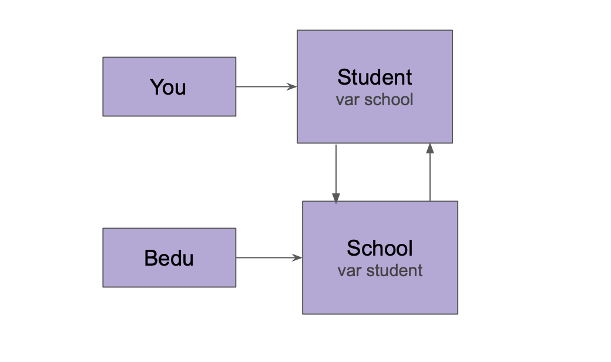

`Desarrollo Mobile` > `Swift Intermedio` 

## Implementacion de Reto-02 con Structs

### OBJETIVO 

- Aprender a detectar Retain Cycles con las herramientas de Xcode y como corregirlo.

#### REQUISITOS 

1. Xcode 

#### DESARROLLO

1.- De acuerdo al diagrama del reto anterior, analiza si es posible implementar el diseño con structs en vez de class, y si con eso se evita el **retainCycle**.

        
Solución

La respuesta es no es posible.

