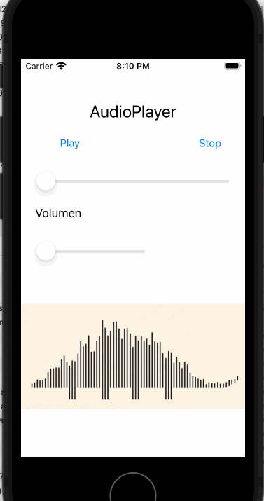

`Desarrollo Mobile` > `Swift Intermedio`

#### **POSTWORK**

#### Sesión 07

### **Convivencia con Objective-C**

#### **Objetivos**

●   Relacionar la implementación de Objective-C y Swift en un App iOS

●   Utilizar una clase escrita en Objective-C para agregar funcionalidades a un App desarrollada mayormente en Swift

#### **Desarrollo:**

En este Postwork se usarán clases de Objective-C en el proyecto, aunque este ha sido desarrollado mayormente en Swift, lo que agregará elementos de función y de valor a la app.

Recuerda que todo lo trabajado en tu prework, así como durante la sesión, puede ser aplicado a tu proyecto personal.

#### **Asegúrate de comprender:**

1. Cómo se agregan clases a un proyecto Xcode
2. Cómo se relacionan los lenguajes Swift y Objective-C
3. Cómo se configura el archivo “puente” en un proyecto Xcode mixto (ambos lenguajes)

#### **Indicaciones generales:**

El propósito de este Postwork es retomar el proyecto Xcode del módulo y realizar las modificaciones descritas a continuación. 

●   Descarga el archivo GIF de este link:

https://github.com/beduExpert/Swift-Proyecto/blob/main/M%C3%B3dulo-02/Sesi%C3%B3n-07/stegosaurus-studio.gif

●   Descarga la clase, UIImage+animatedGIF de este link:

https://github.com/beduExpert/Swift-Proyecto/blob/main/M%C3%B3dulo-02/Sesi%C3%B3n-07/UIImage%2BanimatedGIF.m 

Recuerda que la clase está escrita en Objective-C y se encuentra conformada por dos archivos. Después de descargarla, agrega al proyecto estos archivos.

●   Revisa estos archivos para comprender **qué es lo que se está definiendo en esta clase**

●   Agrega al proyecto esta clase y configura apropiadamente el archivo Bridging-Header para que se pueda utilizar

●   En la clase AudioPlayer, realizada en la sesión 3, agrega como un objeto UIImageView el GIF descargado, utilizando la clase Objective-C para que la animación se muestre. El resultado debe ser como en la siguiente imagen:

 

