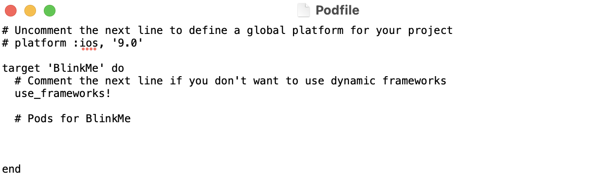

`Desarrollo Mobile` > `Swift Intermedio`

## Cocoapods, primeros pasos

### INTRODUCCIÓN

Cocoapods ya nos permitía agregar dependencias a los proyectos de Objective-C y ahora también funciona con Swift. Esto ha causado que hoy dia se utilice principalmente como la herramienta de gestión de dependencias para proyectos iOS. 

### OBJETIVO

- Aprender a Integrar una Libreria de CocoaPods en un Proyecto de iOS

#### REQUISITOS

1. Conexión a Internet
2. Contraseña de administrador del sistema.
3. Terminal de macOS 
4. Xcode

#### DESARROLLO

Integrando una librería de CocoaPods a un proyecto de iOS.

1.- Crearemos un nuevo proyecto en Xcode, basándonos en Storyboards y Swift. Nómbralo **BlinkMe**

2.- Con la terminal nos dirigimos a la carpeta de nuestro proyecto.

3.- Ya estando en la carpeta, ingresamos el comando:

> $ pod init

Esto creará un nuevo archivo, el archivo Podfile.

4.- Tendremos que editar el archivo usando cualquier editor de texto, o bien el comando ***vi*** en la terminal. La estructura de un archivo Podfile es la siguiente:




5.- Vamos a instalar un Pod llamado **BlinkButton**. Así que escribimos en el Podfile.

> pod "BlinkButton"

Debajo de la línea **# Pods for BlinkMe**

6.- Guardamos el archivo, nos vamos a la terminal y tecleamos...

> pod install


7.- Si tenías abierto el proyecto, será necesario cerrarlo y ahora tendremos que abrir el archivo con extensión .xcodeproj

8.- En el archivo ViewController.swift, que es la clase conectada con el viewController inicial, debemos importar el paquete para poder utilizarlo, de esta forma:

````
import BlinkButton
````

9.- Ahora ya podemos utilizar la (s) clase(s) que están definidas dentro del paquete, como cualquier otra clase Swift. En el método **viewDidLoad** agrega el siguiente código:

````
        let aButton = BlinkButton()
        aButton.setTitle("I'm Blinking!", for: .normal)
        aButton.frame.size = CGSize(width: 200, height: 45)
        aButton.backgroundColor = .red
        aButton.center = self.view.center
        self.view.addSubview(aButton)
        aButton.toggleBlink()
````

10.- Ejecuta el proyecto en el simulador de tu preferencia, y observa el resultado.


