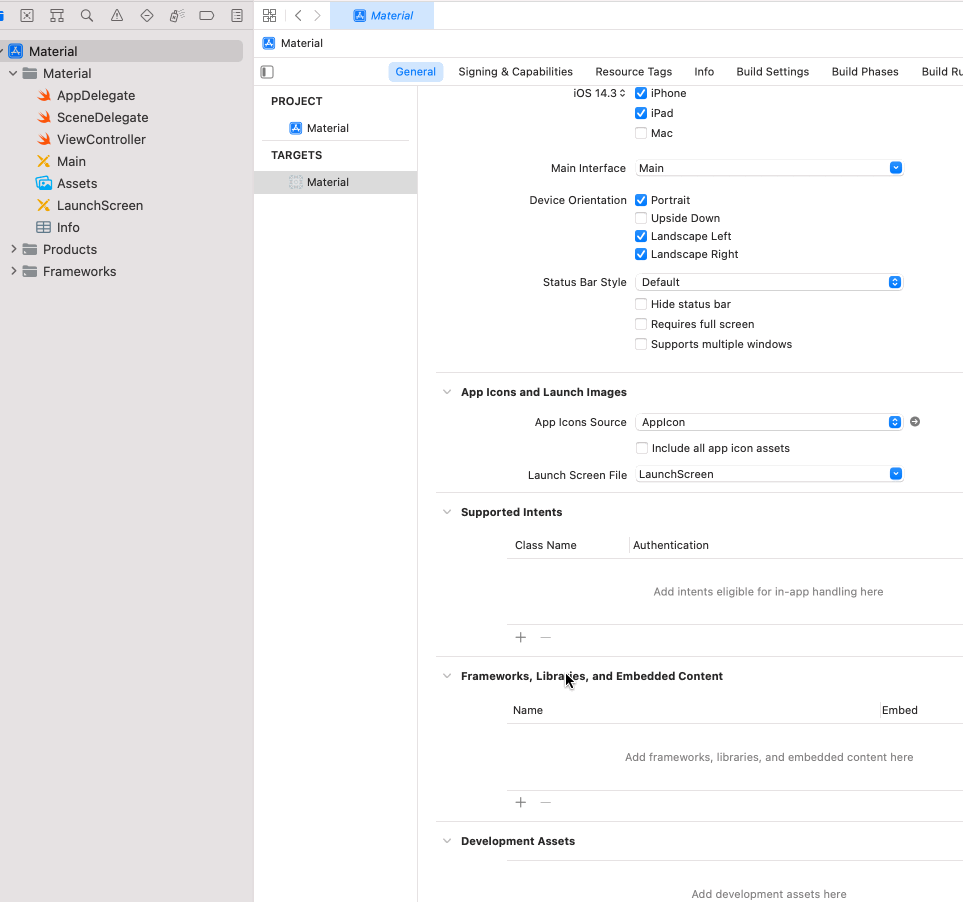

Desarrollo Mobile` > `Swift Intermedio` 

## Agregando dependencias con Carthage

### OBJETIVO

Aprender como agregar y compilar dependencias con Carthage


#### REQUISITOS
1. Conexión a Internet
2. Contraseña de administrador del sistema.
3. Terminal de macOS 
4. Xcode 


#### DESARROLLO

Vamos a crear una App donde se muestre una animación. Integrando una librería de Carthage a un proyecto de iOS.


1.- Crearemos un nuevo proyecto en Xcode, basándonos en Storyboards y Swift.

2.- Con la Terminal nos dirigimos a la carpeta de nuestro proyecto.

3.- Ingresamos este comando para crear un Cartfile.

````
touch Cartfile
````

4.- Abrimos el archivo en Xcode con este comando:

````
open -a Xcode Cartfile
````

5.- Agregamos la URL del paquete que vamos a usar. Este paquete nos ofrece muchas opciones para personalizar y hacer más dinámicos los objetos UIKit.
````
github "CosmicMind/Material"
````

6.- Salvamos y cerramos el archivo, y regresamos a la Terminal. Ahora introducimos este comando para descargar todos los paquetes relacionados en el archivo Cartfile:
````
carthage update --use-xcframeworks
````

7.- Una vez finalizado, agregaremos el framework en nuestros Linked Libraries.

Debe estar en un Path parecido a este:

> ./Carthage/Build/Material.xcframework



En el caso de este paquete, se ocupan dos frameworks, recuerda que siempre es necesario consultar la documentación de los paquetes que agreguemos a nuestro proyecto. En la misma carpeta encontrarás **Motion.xcframework**. Repite el proceso anterior para agregarlo.

8.- Desarrollaremos la App agregando el Framework a nuestra clase ViewController.swift

````
import Material
````

9.- En el método **viewDidLoad** agrega este código:

````
        let emailField = ErrorTextField()
        emailField.placeholder = "Email"
        emailField.isClearIconButtonEnabled = true
        emailField.isPlaceholderUppercasedWhenEditing = true
        emailField.placeholderAnimation = .hidden
        emailField.placeholderNormalColor = Color.amber.darken4
        emailField.placeholderActiveColor = Color.pink.base
        emailField.dividerNormalColor = Color.cyan.base
        emailField.dividerActiveColor = Color.green.base
        let leftView = UIImageView()
        leftView.image = Icon.email
        emailField.leftView = leftView
        emailField.frame.size = CGSize(width: 200, height: 45)
        emailField.center = self.view.center
        self.view.addSubview(emailField)
````


