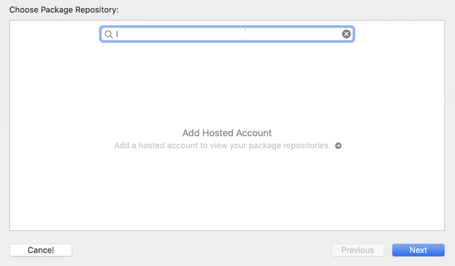
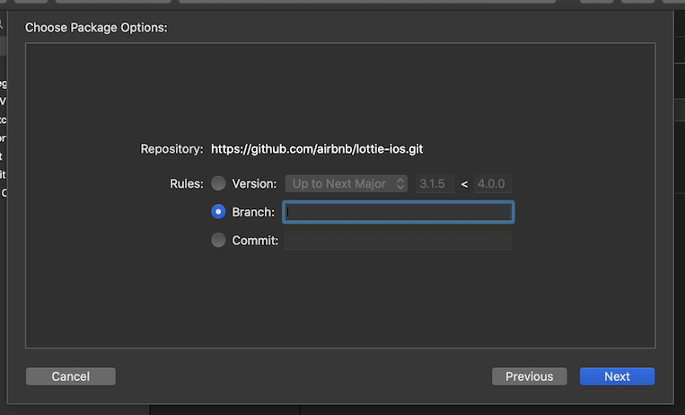
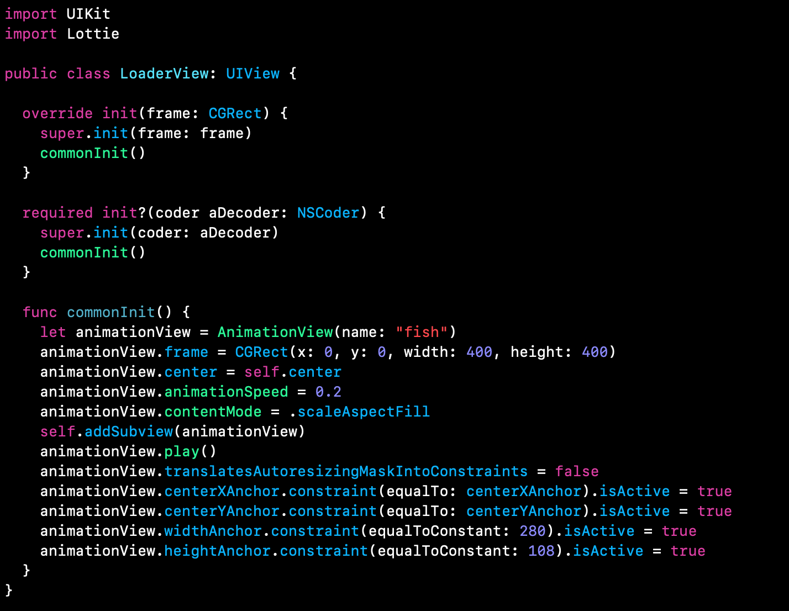

`Desarrollo Mobile` > `Swift Intermedio`

## Swift Package Manager

### INTRODUCCIÓN

Cocoapods y Carthage nos permiten agregar dependencias a nuestros proyectos Swift, sin embargo la propuesta de Apple tiene la ventaja de que no requiere ninguna instalación adicional, y tampoco se volverá obsoleto ni desactualizado. Estas son las principales razones por las que sugerimos aprender a usar SwiftPM y elegirlo como nuestro gestor de dependencias siempre que el paquete que requerimos esté disponible.

### OBJETIVO

- Aprender a Integrar un paquete en un Proyecto de iOS, ahora utilizando Swift Package Manager

#### REQUISITOS

1. Conexión a Internet
2. Xcode

#### DESARROLLO

1.- Crearemos un nuevo proyecto en Xcode, basándonos en Storyboards y Swift. Nómbralo **Animations**

2.- Vamos a instalar un paquete llamado **Lottie** desde esta ubicación:

````
https://github.com/airbnb/lottie-ios.git
````

En Xcode, selecciona Archivo ▸ Paquetes Swift ▸ Añadir dependencia de paquete.... 

Introduce la URL del paquete y da clic en Next.




3.- En la siguiente ventana, solo tenemos que confirmar el repositorio, la versión del paquete que queremos descargar. Si no se especifica el branch, se asume que hacemos referencia a *master*




4.- Damos clic en Next y eso es todo, SwiftPM descarga y enlaza el paquete sin que tengamos que hacer nada mas. Cuando el paquete se descargue, solo da clic en Finish.

5.- Crea una nueva clase de Swift en el proyecto, nómbrala **LoaderView.swift** y copia este código:



6.- *"fish"* es el nombre del *JSON* que describe todos los parámetros necesarios para realizar la animación. Debemos agregar ese archivo al proyecto. Lo puedes descargar [aquí](fish.json)

7.- En el archivo ViewController.swift, que es la clase conectada con el viewController inicial, debemos agregar una instancia de esa clase Loader para presentar la animación. Agrega este código en el método **viewDidLoad**

````
        let fish = LoaderView()
        fish.frame.size = CGSize(width: 400, height: 400)
        fish.center = self.view.center
        view.addSubview(fish)
        view.backgroundColor = .cyan
````

8.- Ejecuta el proyecto en el simulador de tu preferencia, y observa el resultado.


