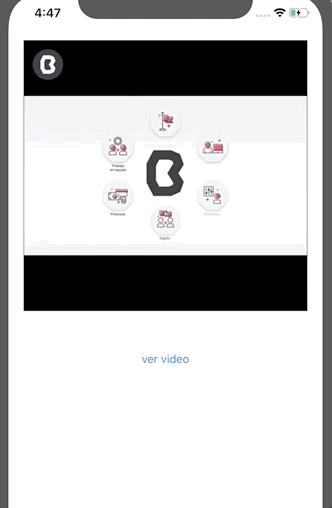

Desarrollo Mobile` > `Swift Intermedio` 

## YouTube App

### OBJETIVO

Aplicar lo aprendido sobre el uso de CocoaPods para agregar dependencias a una app. 

#### REQUISITOS

1. Conexión a Internet
2. Contraseña de administrador del sistema.
3. Terminal de macOS 
4. Xcode

#### DESARROLLO

Esta vez crearemos un proyecto nuevo, donde implementaremos la instalación de este Pod.

El reto consiste en leer la documentación del Pod y aprender como se usa.

Instalar el **Pod** en un proyecto de iOS.

El Pod es para reproducir videos de YouTube.

> https://github.com/youtube/youtube-ios-player-helper

Implementar un **UIView** que herede de la clase del *Pod* (investigar que clase es).

Una vez implementada la clase, agregar un **Key** para reproducir video.

Ejemplo:

> https://www.youtube.com/watch?time_continue=2&v=velPquCnw7k

El Key sería: `velPquCnw7k`.

<details>
        <summary>Solución</summary>
        <p> Instalar el Podfile en el proyecto de Xcode.</p>
        <p> Una vez agregado el Podfile, ir al Storyboard.</p>
        <p> En el Storyboard, agregar un UIView y en el Inspector agregar la Clase. La clase es: YTPlayerView</p>
         <p> Un botón enviará el video a reproducir.</p>
</details>
<p> Para reproducir el video, son necesarios algunos parámetros </p>

```
 public let YouTubeParams: [String: Any] = [
    "autoplay": 0,
    "playsinline" : 1,
    "enablejsapi": 1,
    "wmode": "transparent",
    "controls": 0,
    "showinfo": 0,
    "rel": 0,
    "fs" : 1,
    "modestbranding": 0,
    "iv_load_policy": 3
  ]

```

<p> Será necesario conectar el delegate </p>

```
self.videoView.delegate = self
```



