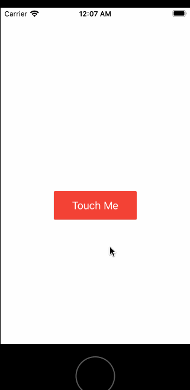

Desarrollo Mobile` > `Swift Intermedio` 

## Material App

### OBJETIVO

Usar el paquete agregado a nuestra app con Carthage. 

#### REQUISITOS

1. Conexión a Internet
2. Contraseña de administrador del sistema.
3. Xcode
4. Proyecto terminado del Ejemplo-02

#### DESARROLLO

El reto consiste en leer la documentación del paquete y aprender como se usa.

1.- Revisa la documentación del paquete **Material** que se encuentra en su repositorio de GitHub:

````
https://github.com/CosmicMind/Material
````


y analiza los distintos elementos de UIKit que se pueden personalizar

2.- Agrega un botón de tipo *Rised Button* a la vista, con fondo rojo titulo blanc, con el texto "Touch Me" para que quede como se ve en la imagen:




<details>

        <summary>Solución</summary>
        <p> Agrega este código al método viewDidLoad:</p>
</details>


```
 let button = RaisedButton(title: "Touch Me", titleColor: .white)
        button.pulseColor = .white
        button.backgroundColor = Color.red.base
        button.frame.size.width = 140
        button.frame.size.height = 48
        button.center = self.view.center
        button.frame = button.frame.offsetBy(dx: 0, dy: 50)
        view.addSubview(button)

```


