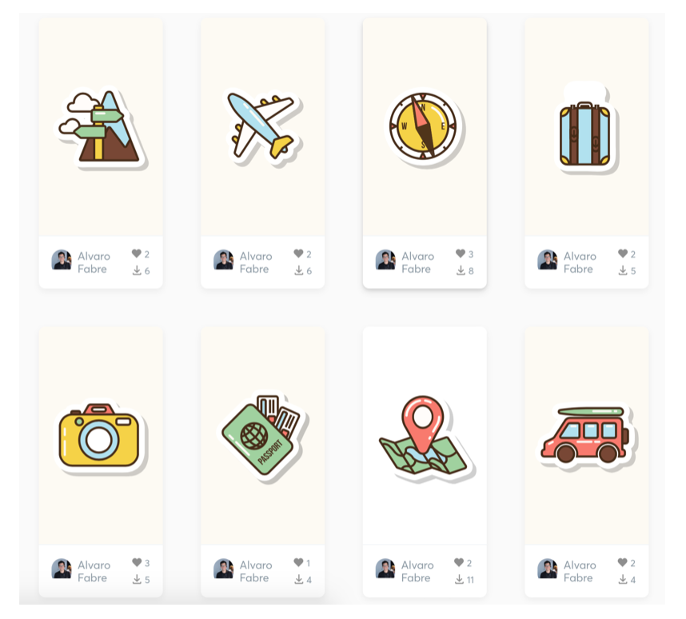

Desarrollo Mobile` > `Swift Intermedio` 
​	
## Más Animaciones 

### OBJETIVO 

- Practicar la instalación de paquetes.
- Adaptar tu clase Loader para hacerla más genérica.
- Aprender a utilizar Lottie.

#### REQUISITOS 

1. Conexión a Internet

2. Xcode 

3. Terminal de macOS (en caso necesario)

4. Contraseña de administrador del sistema. (en caso necesario)

   ​

#### DESARROLLO

1.- Crea un nuevo proyecto para probar más animaciones

2.- Instala el paquete Lottie usando el manejador de dependencias de tu preferencia.

3.- Elige las animaciones que te gusten en [LottieFiles](https://lottiefiles.com/recent?page=6). Descarga los archivos y agregalos a tu proyecto



4.-Modifica lo necesario en la clase **LoaderView**.

<details>
	<summary>Solución</summary>
	<p> En la clase ViewController.swift quedaría así:</p>

```
  var animationView = LoaderView()
  
  override func viewDidLoad() {
    super.viewDidLoad()
    animationView.frame = view.bounds
    view.addSubview(animationView)
    animationView.name = "plane"
    animationView.play()
 }
```
<p> La clase **LoaderView** se modificaria así: </p> 

```
import UIKit
import Lottie

public class LoaderView: UIView {
  
  var name: String?
  
  override init(frame: CGRect) {
    super.init(frame: frame)
  }
  
  required init?(coder aDecoder: NSCoder) {
    super.init(coder: aDecoder)
  }
  
  func play() {
    guard let name = name else { return }
    let animationView = AnimationView(name: name)
    animationView.frame = CGRect(x: 0, y: 0, width: self.frame.width, height: self.frame.height)
    animationView.center = self.center
    animationView.animationSpeed = 0.2
    animationView.contentMode = .scaleAspectFill
    self.addSubview(animationView)
    animationView.play()
    animationView.translatesAutoresizingMaskIntoConstraints = false
    animationView.centerXAnchor.constraint(equalTo: centerXAnchor).isActive = true
    animationView.centerYAnchor.constraint(equalTo: centerYAnchor).isActive = true
    animationView.widthAnchor.constraint(equalToConstant: self.frame.width).isActive = true
    animationView.heightAnchor.constraint(equalToConstant: self.frame.height).isActive = true
  }
}
```

</details> 

