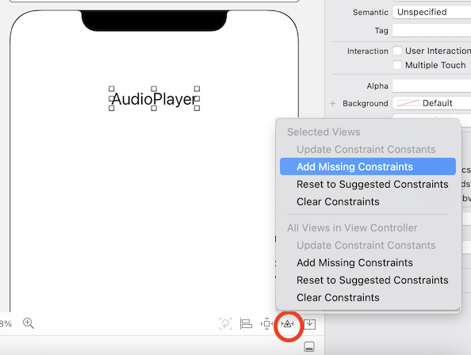
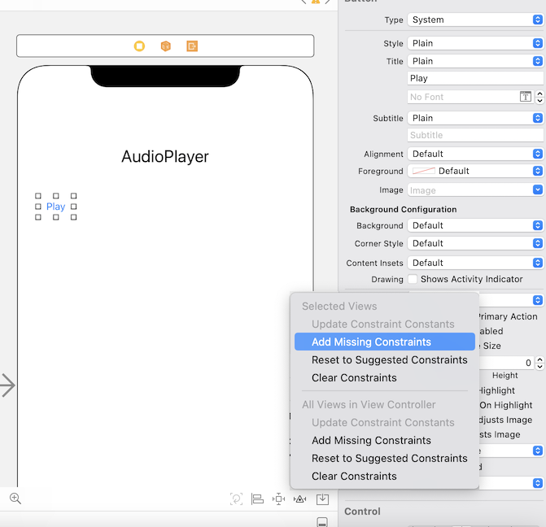
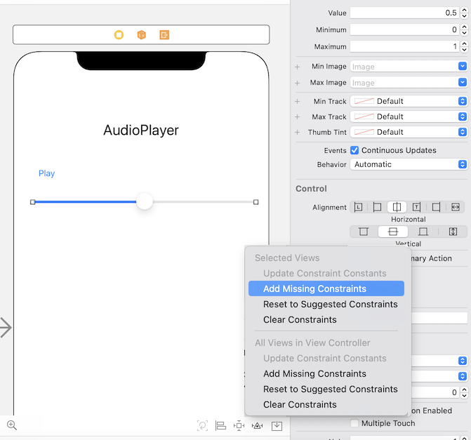
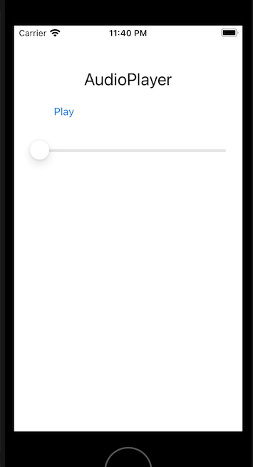

`Desarrollo Mobile` > `Swift Intermedio` 

## Componentes de UIKit

### INTRODUCCIÓN

Para realizar el diseño de la interfaz con el framework UIKit, es necesario conocer los distintos componentes que se pueden colocar en las vistas para poder responder satisfactoriamente a las expectativas de los usuarios.

### OBJETIVO

- Aprender a utilizar algunos de los componentes de UIKit y conectarlos al ViewController.

#### REQUISITOS

1. Proyecto terminado del modulo 1.

#### DESARROLLO

1.- Como recordarás, desde la librería de objetos puedes arrastrar cualquiera de ellos hacia la vista para crear una instancia del Objeto. Añade una vista adicional al Storyboard, asigna la propiedad **is initial view controller** para que sea la primera vista en mostrarse en el simulador, y en ella recrearemos el sig. Layout. 

- Los objetos que integran la interfaz son (de arriba hacia abajo, izquierda a derecha):
  - UILabel (con el texto AudioPlayer).
  - UIButton (con el texto Play).
  - UIButton (con el texto Stop).
  - UISlider (para controlar la reproducción, adelantar/retroceder).
  - UILabel (con el texto volumen).
  - UISlider (para controlar el volumen).
- Para agregar el primer elemento UILabel, arrástralo desde la librería hasta la vista y asegúrate de alinearlo con la guía de centrado. Luego configura las siguientes propiedades:

- Si ejecutas el app en varios simuladores, observarás que la etiqueta no se muestra centrada. Una técnica rápida para que los objetos se mantengan tal y como los colocamos en el storyboard, es utlizar el botón **Resolve Auto Layout issues** que se encuentra en la esquina inferior izquierda de la barra de herramientas del Storyboard, y usar la opción "Add Missing Constraints" como se observa en la siguiente imagen:

- Para agregar el primer elemento UIButton, arrástralo desde la librería y colócalo en la vista. Configura las propiedades y asigna las constraints como se ve en la siguiente imagen:

  

- Para agregar el primer elemento UISlider, el proceso será muy similar a lo que has hecho antes, considera que las propiedades y constranits deben quedar como en la siguiente imagen:

- En este momento si ejecutas la App en cualquier simulador, la vista se debe ver como en la siguiente imagen:

  
