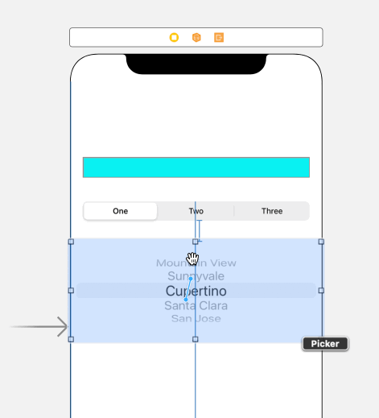

`Desarrollo Mobile` > `Swift Intermedio` 

## Componentes de UIKit que usan delegados

### INTRODUCCIÓN

Para configurar objetos que pueden presentar contenido dinámico como lo es el TableView, es necesario entender el concepto de delegación y la manera en que se implementa este mecanismo en determinados objetos de UIKit.

### OBJETIVO

-  Aprender la manera en que se configura un objeto UIPickerView 
-  Identificar como usar delegados con los objetos de la interfaz

#### REQUISITOS

1. Ejemplo-02 terminado

#### DESARROLLO

El objeto UIPickerView nos permite mostrar al usuario opciones de selección, lo que podría ser el equivalente a un componente "Select" en una página Web. En este ejemplo vamos a colocar y configurar un objeto de este tipo en tu aplicación actual.

1. Agrega el objeto PickerView a la interfaz, debajo del SegmentedControl. Como siempre, recuerda configurar las constraints necesarias.
2. Observa que si ejecutas el App, el objeto UIPickerView no se muestra, ya que es necesario que nuestra clase cumpla con los protocolos UIPickerViewDelegate y UIPickerViewDataSource para que el objeto se pueda crear correctamente. 
3. Agrega a la cabecera de la clase los protocolos: **UIPickerViewDelegate, UIPickerViewDataSource **

4. Cuando agregamos la especificación de los protocolos, se genera un error pues hay un par de métodos que es obligatorio implementar. Estos métodos son:

  **func** numberOfComponents(in pickerView: UIPickerView) -> Int

   **func** pickerView(**_** pickerView: UIPickerView, numberOfRowsInComponent component: Int) -> Int

  Acepta la sugerencia de Xcode y deja que el esqueleto de esos métodos se agregue a la clase. Los completaremos más tarde

5. Crea un arreglo con los datos que vamos a visualizar

   **let** dataArray = ["English", "Maths", "History", "German", "Science"]

6. Completa y agrega el código siguiente:

    **func** numberOfComponents(in pickerView: UIPickerView) -> Int {

​      **return** 1

​	}

​     **func** pickerView(**_** pickerView: UIPickerView, numberOfRowsInComponent component: Int) -> Int {

  ​    **return** dataArray.count

​	}

   **func** pickerView(**_** pickerView: UIPickerView, titleForRow row: Int, forComponent component: Int) -> String? {  

​      **let** row = dataArray[row]

​      **return** row

}

  

7. En el Storyboard, es necesario conectar el objeto PickerView con el código Swift, especificando que se implementará la función de **delegate **y **datasource**. Selecciona el objeto PickerView y con el clic secundario del mouse arrastra hasta el icono de FileOwner, como se observa en la siguiente animación:

   

8. Ahora vuelve a ejecutar el app, y el resultado debe ser como en la siguiente imagen:

