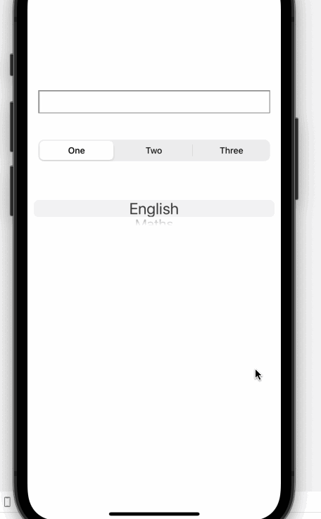
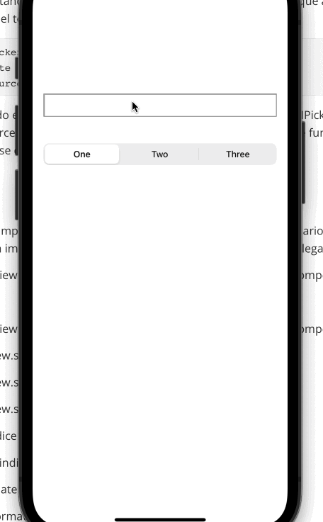

`Desarrollo Mobile` > `Swift Intermedio` 

## Utilizando el objeto UIPicker con el objeto UITextField

### INTRODUCCIÓN

Una parte muy importante que debemos considerar es la introducción de datos en el app, que al mismo tiempo que debe ser flexible, tiene que permitir la validación intrínseca de la información que requerimos por parte del usuario del App.


### OBJETIVO

- Utilizar el objeto UIPickerView en combinación con el objeto UITextField para mejorar la experiencia de usuario.

#### REQUISITOS

1. Ejemplo-03 completado.

#### DESARROLLO

1. En nuestra app actualmente tenemos un objeto UITextField colocado arriba del PickerView, observa que si tocas el textfield, el teclado aparece automáticamente, y eso puede ocuasionar un problema con la usabilidad de la interfaz pues en pantallas pequeñas eso podría evitar alcanzar el pickerview, por lo que tenemos que implementar la funcionalidad de que la vista pueda enterarse cuando el teclado ya no es necesario, esto sería, cuando el usuario toque en el "fondo" de la vista, fuera del cuadro de texto. Para ello, implementaremos el siguiente método en el código de nuestra clase Swift:

   ```
   override func touchesEnded(_ touches: Set<UITouch>, with event: UIEvent?) {
           super.touchesEnded(touches, with: event)
           self.view.endEditing(true)
       }
   ```

   Ejecuta el app, y observa el comportamiento. Si el teclado no aparece en el simulador, pulsa la combinación **command + K**

2. Y luego vamos a implementar un comportamiento que es bastante común en las Apps. Supongamos que necesitamos que el usuario introduzca un dato restringido (en este caso es una materia, pero podría ser un estado de la república, o una marca de autos, etc). Si solamente colocamos el cuadro de texto, después tendríamos que implementar la validación del texto introducido, lo cual nos llevaría a mayores complicaciones. Lo que se acostumbra hacer, es utilizar los cuadros de texto como el objeto de entrada de datos, pero si queremos controlar estrictamente lo que introduce el usuario, no le mostraremos el teclado sino el objeto PickerView, para que solo pueda elegir entre un conjunto determinado de opciones que ya tenemos configuradas en el picker. Para esto, en primer lugar debemos tener una referencia al objeto PickerView que deseamos usar. Tal vez lo más común que se nos ocurriría, sería conectar el objeto que ya tenemos en la vista, con un IBOutlet, de esta forma:


```
@IBOutlet weak var picker:UIPickerView!
```

Luego tendrás que conectarlo en el Storyboard como ya sabes hacerlo. Y vamos a probar si es que funciona como lo esperamos	

3. Ahora debemos especificar que el cuadro de texto utilizará una vista de entrada que no es la entrada estándar, para que no aparezca el teclado. Agrega este código a nuestra clase Swift:

```
override func viewDidAppear(_ animated: Bool) {
        super.viewDidAppear(animated)
        cuadroTexto.inputView = picker
    }
```

4.  Ahora ejecuta nuevamente el app. Verás que aparece no solo el cuadro de texto sino todos los controles tal cual lo teníamos previamente, y luego de que se toque dentro de el cuadro de texto, desaparece el PickerView, y aparece abajo (justo en el espacio que antes ocupaba el teclado). Observa también que el método para desactivar el textfield ha dejado de funcionar.

   

5. Lo que está ocurriendo aquí, es que el pickerview le "pertenece" al Storyboard, y  como lo estamos conectando para utilizarlo con el textfield, entonces se está creando un **Retain Cycle** que provoca que la jerarquía de objetos en la vista, falle. (En la sesión de manejo de memoria se aclarará este tema). Para resolver este problema, tendrémos que retirar el pickerview del Storyboard y crearlo con código en nuestra clase Swift, para que el textfield sea el propietario y el encargado de presentarlo y retirarlo de la vista cuando sea necesario.  Para empezar elimina el objeto desde el Storyboard, y en la línea de código que agregamos en el paso 2, borra "@IBOutlet weak" para que solo quede así:

   ```​
   var picker:UIPickerView!
   ```

   ​

6. Ahora deberémos instanciar el picker, para poder conectarlo con el textfield y que aparezca el objeto UIPickerView en vez del teclado. Agrega este código al método **viewDidLoad** 


```
		picker = UIPickerView()
        picker.delegate = self
        picker.dataSource = self
```

7. Como ya tenemos todo el código necesario para implementar los protocolos UIPickerViewDelegate y UIPickerViewDataSource, entonces podemos ejecutar el app ahora, y todo debe funcionar correctamente como se espera:




7. Ahora solo debemos implementar el llenado del cuadro de texto cuando el usuario elija una materia en el picker, asi que para eso vamos a implementar este método del protocolo UIPickerViewDelegate:


**func** pickerView(**_** pickerView: UIPickerView, didSelectRow row: Int, inComponent component: Int) {

 	**let** indice = pickerView.selectedRow(inComponent: 0)

​	**let** materia = dataArray[indice]

​         cuadroTexto.text = materia

}


Analiza todo el código que hemos utilizado en este ejemplo. ¿Lo comprendes bien? Si tienes cualquier duda sobre la forma en que se puede combinar el uso del Storyboard para colocar objetos UIKit y la creación dinámica con código ¡Consúltalo con el experto!

