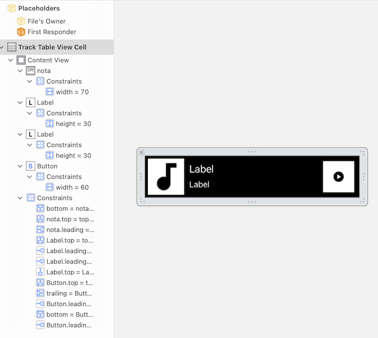

`Desarrollo Mobile` > `Swift Intermedio` 

### **POSTWORK**

#### Sesión 03

#### **Elementos de UlKit**

 

#### **Objetivos**

●   Identificar el contexto de aplicación de las distintas clases del framework UIKit y usar algunas.

●   Diseñar la personalización de las celdas de un TableView utilizando un archivo .xib

#### **Desarrollo:**

En esta sesión se completará la definición de la vista del Tableview. Recuerda que todo lo trabajado en tu prework, así como durante la sesión, puede ser aplicado a tu proyecto personal. 

#### **Asegúrate de comprender:**

1. Cuándo y cómo es necesario utilizar cada objeto del framework UIKit
2. Cómo configurar el tamaño y posición de un objeto
3. Cómo crear y utilizar archivos .xib

#### **Indicaciones generales:**

El propósito de este Postwork es retomar el proyecto Xcode del módulo y realizar las modificaciones descritas a continuación.

●   Recuerda la clase agregada en el Postwork 02 (TrackTableViewCell), subclase de UITableViewCell. Ahora crea su correspondiente archivo .xib y relacionalo con el código Swift, tal como se realizó en la sesión con el experto. Nombra este archivo TrackTableViewCell.xib

- En este archivo .xib, agrega los objetos necesarios, para que las celdas del TableView se ven como en la siguiente imagen:

- Los objetos presentes son: un imageview, dos labels y un botón con imagen.

 

- Configura las propiedades de los objetos para conseguir el look & feel solicitado

Los iconos de la nota musical y el botón play, se pueden obtener gratuitamente de los siguientes links:

https://fonts.google.com/icons?selected=Material+Icons:audiotrack:

https://fonts.google.com/icons?selected=Material+Icons:play_circle:

- Agrega los constraints necesarios para que los objetos se mantengan colocados correctamente. El resultado final será como en la siguiente imágen:

- Crea los outlets necesarios para conectar los objetos con su código Swift asociado. Estos outlets se utilizarán posteriormente para asignar el título y artista de la canción.
- Registra esta clase así como su archivo .xib para utilizarse en el TableView y recuerda asignar correctamente el identificador para que la celda pueda ser reutilizable.