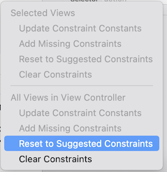

 `Desarrollo Mobile` > `Swift Intermedio` 
​	
## Integrando mas componentes de UIKit

### OBJETIVO 

- Agregar más controles al **Ejemplo-01**

#### REQUISITOS 

1. Haber concluido el Ejemplo-01 de componentes de UIKit.

#### DESARROLLO

Ya sabes mostrar elementos en una Vista. Es momento de agregar los elementos restantes utilizando las técnicas aprendidas en el ejemplo1. Recuerda que es importante considerar los constraints, pero también te darás cuenta que de pronto la función *Resolve Auto Layout issues** no es 100% precisa, así que tendrémos que lidiar con los constraints de otra manera (que se verá en el siguiente ejemplo)

1. Agregar otro botón al lado contrario del primero
2. Agregar el segundo slider y su etiqueta "volumen". 
3. Al finalizar el reto la interfaz debe verse como en la imagen:


<details>
        <summary>Solución</summary>
<p> 


```
Arrastra y coloca los objetos como sabes hacerlo, configura las properties necesarias para que se muestren correctamente los titulos y tamaños, y para resolver el tema de las constraints, Asegurate de no tener seleccionado ningún objeto y luego utiliza el botón <b>Resolve Auto Layout issues</b> pero eligiendo la opción <i>Reset to suggested constraints</i>, del segundo grupo de opciones, como se vé en la siguiente figura:
```



</p>

</details>